<h1 align="center">IEMS5730 Spring2022 Homework#0</h1>

<p align="center">1155162635 LIU Zijian </p>

<h2 align="center">Declaration</h2>


[TOC]

## **Part a[20 Marks]** Single-Node Hadoop Cluster Setup

### i. Setup a single-node Hadoop cluster

- **Creating and Configuring VM**

  -Hardware Info: n1-standard-2(Intel Skylake) /100GB SSD /  2 CPU cores / 7.5GB RAM

  -System: Ubuntu 18.04

  -Firewall Configuration: Open all ports for personal IP address

- **Create an Account for Hadoop**

  ```shell
  bentholomew_lau@master-single-node:~$ sudo -i
  root@master-single-node:~$ adduser hduser
  root@master-single-node:~$ exit
  bentholomew_lau@master-single-node:~$ sudo adduser hduser sudo
  bentholomew_lau@master-single-node:~$ su hduser
  ```

- **Installing & Configuring Java**[^1]

  -Install Java 8 from reposistory

  ```shell
  hduser@master-single-node:~$ sudo apt-get update
  hduser@master-single-node:~$ sudo apt-get install openjdk-8-jre -y
  hduser@master-single-node:~$ sudo apt-get install openjdk-8-jdk -y
  ```

  -Configuring Java in the profile

  ```shell
  hduser@master-single-node:~$ sudo vi /etc/profile
  export JAVA_HOME=/usr/lib/jvm/java-8-openjdk-amd64
  export PATH=$JAVA_HOME/bin:$PATH
  export CLASSPATH=.:$JAVA_HOME/lib/dt.jar:$JAVA_HOME/lib/tools.jar
  hduser@master-single-node:~$source /etc/profile
  hduser@master-single-node:~$echo $JAVA_HOME
  hduser@master-single-node:~$java -version
  ```

  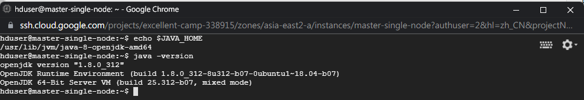

- **Installing & Configuring Hadoop**[^2][^3]

  -Download from the official image website and move the folder to /usr/local/

  ```shell
  hduser@master-single-node:~$wget https://archive.apache.org/dist/hadoop/common/hadoop-2.9.2/hadoop-2.9.2.tar.gz
  hduser@master-single-node:~$sudo tar -zxf hadoop-2.9.2.tar.gz -C /usr/local
  hduser@master-single-node:~$cd /usr/local
  hduser@master-single-node:~$sudo mv ./hadoop-2.9.2 ./hadoop
  hduser@master-single-node:~$sudo chown -R hduser ./hadoop
  ```

  -Add Java Path to hadoop-env.sh

  ```shell
  hduser@master-single-node:~$echo 'export JAVA_HOME=/usr/lib/jvm/java-8-openjdk-amd64' >> /usr/local/hadoop/etc/hadoop/hadoop-env.sh
  ```

  -Entering the hadoop folder, start to configure a single-node cluster in pseudo-distributed mode

  ```shell
  hduser@master-single-node:~$cd /usr/local/hadoop
  hduser@master-single-node:/usr/local/hadoop$ sudo vi ./etc/hadoop/core-site.xml
  hduser@master-single-node:/usr/local/hadoop$ sudo vi ./etc/hadoop/hdfs-site.xml
  ```

  -core-site.xml

  ```xml
  <configuration>
      <property>
          <name>fs.defaultFS</name>
          <value>hdfs://localhost:9000</value>
      </property>
  </configuration>
  ```

  -hdfs-site.xml

  ```xml
  <configuration>
      <property>
          <name>dfs.replication</name>
          <value>1</value>
      </property>
  </configuration>
  ```

  -Configure the environment Variable in the hadoop folder

  ```shell
  hduser@master-single-node:/usr/local/hadoop$ sudo vi /home/hduser/.bashrc
  #add the configuration directory
  export HADOOP_PREFIX=/usr/local/hadoop
  export HADOOP_HOME=/usr/local/hadoop
  export HADOOP_MAPRED_HOME=${HADOOP_HOME}
  export HADOOP_COMMON_HOME=${HADOOP_HOME}
  export HADOOP_HDFS_HOME=${HADOOP_HOME}
  export YARN_HOME=${HADOOP_HOME}
  export HADOOP_CONF_DIR=${HADOOP_HOME}/etc/hadoop
  # Native Path
  export HADOOP_COMMON_LIB_NATIVE_DIR=${HADOOP_PREFIX}/lib/native
  export HADOOP_OPTS="-Djava.library.path=$HADOOP_PREFIX/lib"
  export PATH=$PATH:$HADOOP_HOME/bin:$HADOOP_HOME/sbin
  export JAVA_HOME=/usr/lib/jvm/java-8-openjdk-amd64
  export JRE_HOME=/usr/lib/jvm/java-8-openjdk-amd64/jre
  export PATH=$PATH:/usr/lib/jvm/java-8-openjdk-amd64/bin:/usr/lib/jvm/java-8-openjdk-amd64/jre/bin
  #Source the file
  hduser@master-single-node:/usr/local/hadoop$ source /home/hduser/.bashrc
  ```

- **Setup SSH to connects localhost without passwords**

  ```shell
  hduser@master-single-node:~$ ssh-keygen -t rsa -P '' -f ~/.ssh/id_rsa
  hduser@master-single-node:~$ cat ~/.ssh/id_rsa.pub >> ~/.ssh/authorized_keys
  hduser@master-single-node:~$ chmod 0600 ~/.ssh/authorized_keys
  ```

- **Format the namenode and start services**

  ```shell
  hduser@master-single-node:/usr/local/hadoop$ ./bin/hdfs namenode -format
  hduser@master-single-node:/usr/local/hadoop$ ./sbin/start-dfs.sh
  ```

- **Result**

  Successfully setup single-node Hadoop cluster(v2.9.2) on VM on Google Cloud

  Screenshot of `port 50070`

  

### ii. Run the TeraSort Program on a single-node hadoop

- **Code**[^4]

  ```shell
  hduser@master-single-node:~/usr/local/hadoop$ ./bin/hadoop jar ./share/hadoop/mapreduce/hadoop-mapreduce-examples-2.9.2.jar teragen 100000 terasort/input
  hduser@master-single-node:~/usr/local/hadoop$ ./bin/hadoop jar ./share/hadoop/mapreduce/hadoop-mapreduce-examples-2.9.2.jar terasort terasort/input terasort/output
  hduser@master-single-node:~/usr/local/hadoop$ ./bin/hadoop jar ./share/hadoop/mapreduce/hadoop-mapreduce-examples-2.9.2.jar teravalidate terasort/output terasort/check
  ```

- **Result**

  -TeraGen Result

  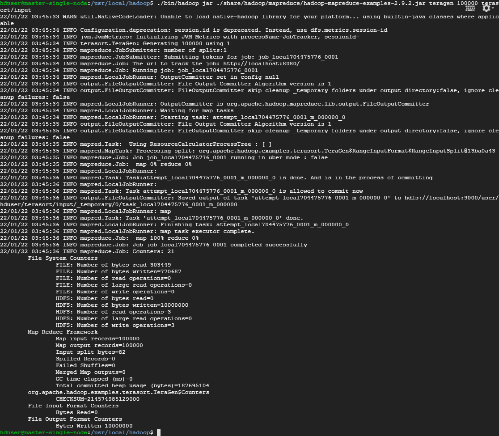

  -TeraSort Result

  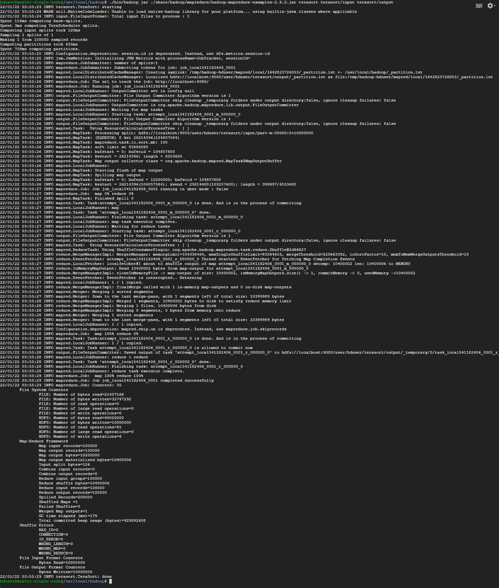

  -TeraValidate Result

  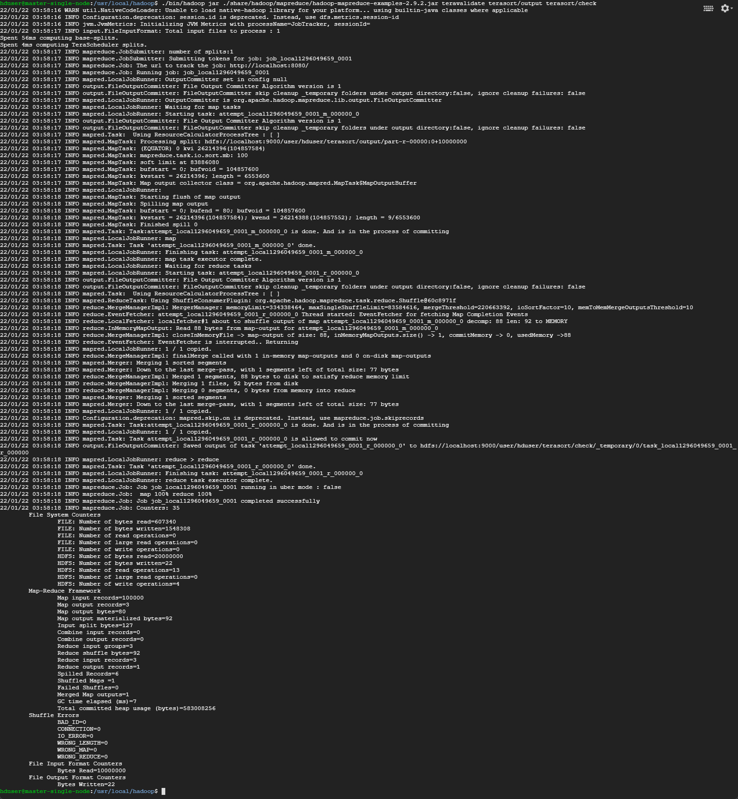


## **Part b[40 Marks]** Multi-Node Hadoop Cluster Setup

### i. Setup a multi-node Hadoop cluster[^5][^6]

- **Creating & Initializing 4 VM instances(1 namenode + 3 datanodes) **

  -Creating an instance named "master" as `NameNode`, install & configure Java as part a

  -Create user "hduser" and grant with sudo

  ```shell
  bentholomew_lau@master:~$sudo -i
  root@master:~#adduser hduser
  root@master:~#sudo adduser hduser sudo
  ```

  -Modify SSH Settings: Enabling <u>password</u> and <u>key based authentication</u>

  ```shell
  root@master:~# vi /etc/ssh/sshd_config
  root@master:~# service sshd restart
  ```

  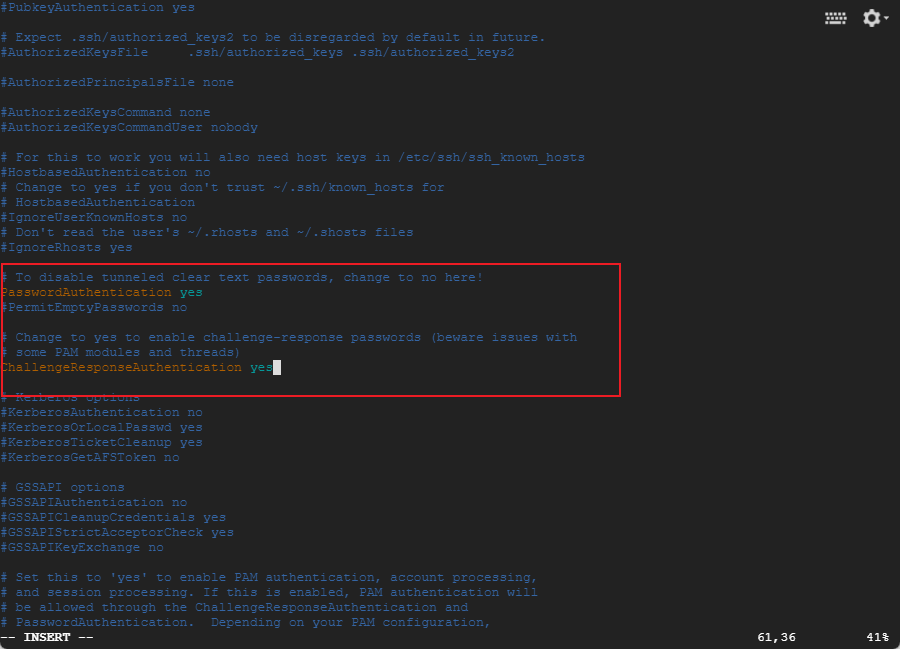

  -Backup the image of this `NameNode` instance, create 3 `DataNode` instances from the image, name them in sequence `slave1` / `slave2` / `slave3` (select the same network region: asia-east2-a)

  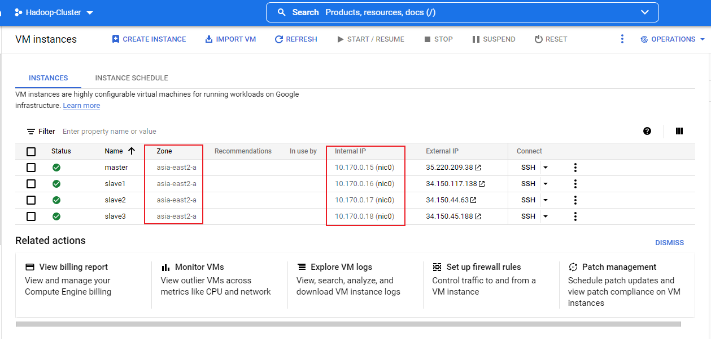

- **Building SSH connection among the machines**[^7]

  -Add other nodes' ip&name for communicate: Modify `/etc/hosts` (take master as an example)

  ```shell
  #Lookup the hostname and IP address of the instance
  hduser@master:~$ hostname -f
  master.asia-east2-a.c.excellent-camp-338915.internal
  hduser@master:~$ hostname -i
  10.170.0.15
  #add the script to hosts
  hduser@master:~$ sudo vi /etc/hosts
  10.170.0.15 master.asia-east2-a.c.excellent-camp-338915.internal master  # Added by Google
  10.170.0.16 slave1.asia-east2-a.c.excellent-camp-338915.internal slave1
  10.170.0.17 slave2.asia-east2-a.c.excellent-camp-338915.internal slave2
  10.170.0.18 slave3.asia-east2-a.c.excellent-camp-338915.internal slave3
  ```

  -Generate ssh key and copy the file to other 3 nodes to login without password

  ```shell
  hduser@master:~$ ssh-keygen -t rsa -P ""
  hduser@master:~$ cat ./.ssh/id_rsa.pub >> ./authorized_keys
  
  hduser@master:~$ ssh-copy-id -i /home/hduser/.ssh/id_rsa.pub hduser@master
  hduser@master:~$ ssh-copy-id -i /home/hduser/.ssh/id_rsa.pub hduser@slave1
  hduser@master:~$ ssh-copy-id -i /home/hduser/.ssh/id_rsa.pub hduser@slave2
  hduser@master:~$ ssh-copy-id -i /home/hduser/.ssh/id_rsa.pub hduser@slave3
  hduser@master:~$ chmod 0600 ~/.ssh/authorized_keys
  hduser@master:~$ ssh slave1 #test connecting by name
  ```

- **Installing & Configuring Hadoop on Namenode **[^8]

  -Install Hadoop as part a

  ```shell
  hduser@master:~$ wget https://archive.apache.org/dist/hadoop/core/hadoop-2.9.2/hadoop-2.9.2.tar.gz
  hduser@master:~$ sudo tar -zxf hadoop-2.9.2.tar.gz -C /usr/local
  hduser@master:~$ sudo mv /usr/local/hadoop-2.9.2 /usr/local/hadoop
  hduser@master:~$ sudo chown -R hduser /usr/local/hadoop #Grant the rights with hduser
  ```

  -Add Java Path in hadoop-env

  ```shell
  hduser@master:~$ echo 'export JAVA_HOME=/usr/lib/jvm/java-8-openjdk-amd64' >> /usr/local/hadoop/etc/hadoop/hadoop-env.sh
  ```

  -Generate relevant paths on namenode

  ```shell
  hduser@master:~$ sudo mkdir -p /usr/local/hadoop_store/tmp 
  hduser@master:~$ sudo mkdir -p /usr/local/hadoop_store/hdfs/namenode 
  hduser@master:~$ sudo mkdir -p /usr/local/hadoop_store/hdfs/datanode 
  hduser@master:~$ sudo mkdir -p /usr/local/hadoop_store/hdfs/secondarynamenode 
  ```

  -Enter the folder with hadoop configuration files

  ```shell
  hduser@master:~$ cd /usr/local/hadoop/etc/hadoop/
  ```

  -Edit hdfs-site.xml file 

  ```xml
  <configuration>
      <property>
      	<name>dfs.replication</name>
      	<value>3</value>
      </property>
      <property>
          <name>dfs.namenode.name.dir</name>
          <value>file:/usr/local/hadoop_store/hdfs/namenode</value>
      </property>
      <property>
          <name>dfs.datanode.data.dir</name>
          <value>file:/usr/local/hadoop_store/hdfs/datanode</value>
      </property>
      <property>
          <name>dfs.namenode.checkpoint.dir</name>
          <value>file:/usr/local/hadoop_store/hdfs/secondarynamenode</value>
      </property>
      <property>
          <name>dfs.namenode.checkpoint.period</name>
          <value>3600</value>
      </property>
  </configuration>
  ```

  -Edit the core-site.xml

  ```xml
  <configuration>
      <property>
          <name>hadoop.tmp.dir</name>
          <value>/usr/local/hadoop_store/tmp</value>
      	<description>A base for other temporary directories.</description>
      </property>
      <property>
          <name>fs.default.name</name>
          <value>hdfs://master:54310</value>
      </property>
  </configuration>
  ```

  -Edit the mapred-site.xml

  ```xml
  <configuration>
      <property>
          <name>mapreduce.framework.name</name>
          <value>yarn</value>
      </property>
      <property>
          <name>mapred.job.tracker</name>
          <value>master:54311</value>
      </property>
  </configuration>
  ```

  -Edit yarn-site.xml 

  ```xml
  <configuration>
  <!-- Site specific YARN configuration properties -->
      <property>
          <name>yarn.resourcemanager.hostname</name>
          <value>master</value>
      </property>
      <property>
          <name>yarn.nodemanager.aux-services</name>
          <value>mapreduce_shuffle</value>
      </property>
      <property>
          <name>yarn.nodemanager.aux-services.mapreduce.shuffle.class</name>
          <value>org.apache.hadoop.mapred.ShuffleHandler</value>
      </property>
       <property>
          <name>yarn.log-aggregation-enable</name>
          <value>true</value>
      </property>
  </configuration>
  ```

  -Configure Environment Variable

  ```shell
  hduser@master:~$ sudo vi /home/hduser/.bashrc
  #add the configuration directory
  export HADOOP_PREFIX=/usr/local/hadoop
  export HADOOP_HOME=/usr/local/hadoop
  export HADOOP_MAPRED_HOME=${HADOOP_HOME}
  export HADOOP_COMMON_HOME=${HADOOP_HOME}
  export HADOOP_HDFS_HOME=${HADOOP_HOME}
  export YARN_HOME=${HADOOP_HOME}
  export HADOOP_CONF_DIR=${HADOOP_HOME}/etc/hadoop
  # Native Path
  export HADOOP_COMMON_LIB_NATIVE_DIR=${HADOOP_PREFIX}/lib/native
  export HADOOP_OPTS="-Djava.library.path=$HADOOP_PREFIX/lib"
  export PATH=$PATH:$HADOOP_HOME/bin:$HADOOP_HOME/sbin
  export JAVA_HOME=/usr/lib/jvm/java-8-openjdk-amd64
  export JRE_HOME=/usr/lib/jvm/java-8-openjdk-amd64/jre
  export PATH=$PATH:/usr/lib/jvm/java-8-openjdk-amd64/bin:/usr/lib/jvm/java-8-openjdk-amd64/jre/bin
  #Source the file
  hduser@master:~$ source /home/hduser/.bashrc
  ```

  -Add the datanodes name in slaves file

  ```shell
  hduser@master:~$ sudo vi /usr/local/hadoop/etc/hadoop/slaves
  #localhost
  master
  slave1
  slave2
  slave3
  ```

  

- **Install & Configure Hadoop on 3 datanodes**

  -Copy `Hadoop` on `DataNode` instances by `ssh` (Using `slave1` as an Example, repeat the same command for `slave2`&`slave3`)

  ```shell
  hduser@master:~$ scp -r /usr/local/hadoop slave1:/home/hduser/ 
  hduser@master:~$ scp -r /usr/local/hadoop_store slave1:/home/hduser/
  hduser@master:~$ scp -r /home/hduser/.bashrc slave1:/home/hduser/
  ```

  -Move the Hadoop from desktop to /usr/local/

  ```shell
  hduser@slave1:~$ sudo mv /home/hduser/hadoop /usr/local/
  hduser@slave1:~$ sudo mv /home/hduser/hadoop_store /usr/local/
  ```

  -Grant the ownership with relevant folder:

  ```shell
  hduser@slave1:~$ chown -R hduser:hduser /usr/local/hadoop
  hduser@slave1:~$ chown -R hduser:hduser /usr/local/hadoop_store
  ```

- **Format namenode & start the services**

  ```shell
  hduser@master:~$ hadoop namenode -format
  hduser@master:~$ start-dfs.sh
  hduser@master:~$ start-yarn.sh
  hduser@master:~$ jps
  ```

- **Result**

  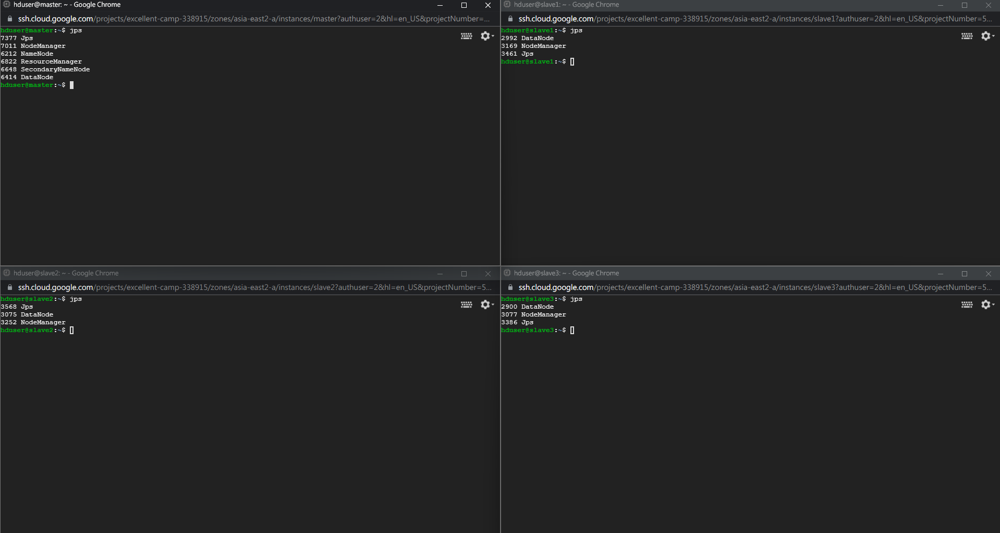

  

### ii. Generate 2 different datasets of 2GB and 20GB,Run the Terasort Program with multi-node Hadoop cluster, and compare the running time

- **Prerequisite**

  100B = 1 row ,1GB = 10000000rows

- **Terasort Program with 2GB Datasets**

  ```shell
  hduser@master:/usr/local/hadoop$ ./bin/hadoop jar ./share/hadoop/mapreduce/hadoop-mapreduce-examples-2.9.2.jar teragen 20000000 terasort/input2GB #Generate
  hduser@master:/usr/local/hadoop$ ./bin/hadoop jar ./share/hadoop/mapreduce/hadoop-mapreduce-examples-2.9.2.jar terasort terasort/input2GB terasort/output2GB #Sort
  hduser@master:/usr/local/hadoop$ ./bin/hadoop jar ./share/hadoop/mapreduce/hadoop-mapreduce-examples-2.9.2.jar teravalidate terasort/output2GB terasort/check2GB #Validate
  ```

- **Terasort Program with 20GB Datasets**

  ```shell
  hduser@master:/usr/local/hadoop$ ./bin/hadoop jar ./share/hadoop/mapreduce/hadoop-mapreduce-examples-2.9.2.jar teragen 200000000 terasort/input20GB #Generate
  hduser@master:/usr/local/hadoop$ ./bin/hadoop jar ./share/hadoop/mapreduce/hadoop-mapreduce-examples-2.9.2.jar terasort terasort/input20GB terasort/output20GB #Sort
  hduser@master:/usr/local/hadoop$ ./bin/hadoop jar ./share/hadoop/mapreduce/hadoop-mapreduce-examples-2.9.2.jar teravalidate terasort/output20GB terasort/check20GB #Validate
  ```

- **Result & Comparison** 

  2GB: Total Time(156s) = Teragen(35s) + Terasort(93s) + TeraValidate(28s)

  20GB: Total Time(14800s) = Teragen(192s) + Terasort(14416s) + TeraValidate(192s)

  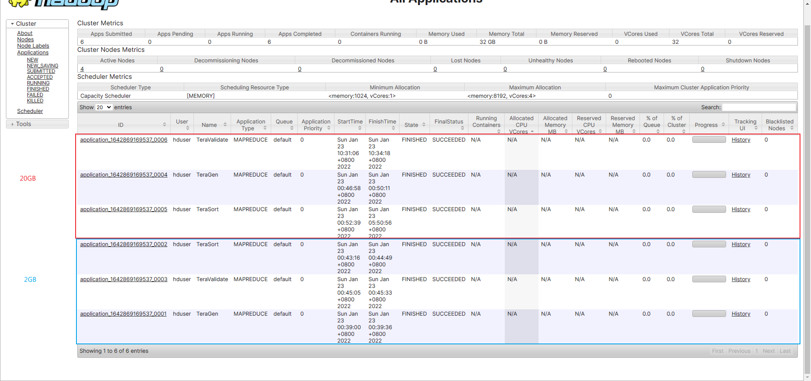

## **Part c[40 Marks]** Running the Python Code on Hadoop[^9]

- **Creating mapper.py and save it to /home/hduser/**

  ```python
  #!/usr/bin/env python3
  """mapper.py"""
  
  import sys
  
  # input comes from STDIN (standard input)
  for line in sys.stdin:
      # remove leading and trailing whitespace
      line = line.strip()
      # split the line into words
      words = line.split()
      # increase counters
      for word in words:
          # write the results to STDOUT (standard output);
          # what we output here will be the input for the
          # Reduce step, i.e. the input for reducer.py
          #
          # tab-delimited; the trivial word count is 1
          print ('%s/t%s' % (word, 1))
  ```

- **Creating reducer.py and save it to /home/hduser**

  ```python
  #!/usr/bin/env python3
  """reducer.py"""
  
  from operator import itemgetter
  import sys
  
  current_word = None
  current_count = 0
  word = None
  
  # input comes from STDIN
  for line in sys.stdin:
      # remove leading and trailing whitespace
      line = line.strip()
  
      # parse the input we got from mapper.py
      word, count = line.split('/t', 1)
  
      # convert count (currently a string) to int
      try:
          count = int(count)
      except ValueError:
          # count was not a number, so silently
          # ignore/discard this line
          continue
  
      # this IF-switch only works because Hadoop sorts map output
      # by key (here: word) before it is passed to the reducer
      if current_word == word:
          current_count += count
      else:
          if current_word:
              # write result to STDOUT
              print '%s/t%s' % (current_word, current_count)
          current_count = count
          current_word = word
  
  # do not forget to output the last word if needed!
  if current_word == word:
      print ('%s/t%s' % (current_word, current_count))
  ```

- **Testing the mapper.py and reducer.py script**[^10]

  ```shell
  hduser@master:~$ sudo apt-get install dos2unix
  hduser@master:~$ chmod +x /home/hduser/mapper.py 
  hduser@master:~$ chmod +x /home/hduser/reducer.py 
  hduser@master:~$ dos2unix /home/hduser/mapper.py 
  hduser@master:~$ dos2unix /home/hduser/reducer.py 
  hduser@master:~$ sudo echo "foo foo quux labs foo bar quux" | /home/hduser/mapper.py #counting the string
  foo     1
  foo     1
  quux    1
  labs    1
  foo     1
  bar     1
  quux    1
  hduser@master:~$ cat /home/hduser/shakespeare | /home/hduser/mapper.py #checking the scripts locally
  ```

  

- **Copy local example data to HDFS**

  ```shell
  hduser@master:~$ start-dfs.sh
  hduser@master:~$ start-yarn.sh
  hduser@master:~$ hadoop dfs -copyFromLocal /home/hduser/shakespeare /user/hduser/shakespeare
  hduser@master:~$ hadoop dfs -ls
  ```

  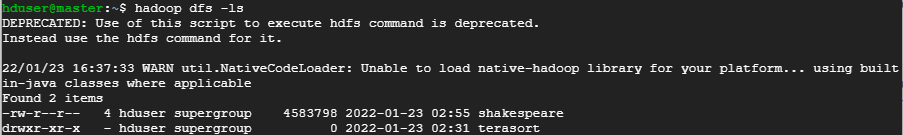

- **Run the MapReduce job using streaming**[^11][^12][^13]

  ```shell
  hduser@master:~$ hadoop jar /usr/local/hadoop/share/hadoop/tools/lib/hadoop-streaming-2.9.2.jar /
   				 -file /home/hduser/mapper.py -mapper /home/hduser/mapper.py /
    				 -file /home/hduser/reducer.py -reducer /home/hduser/reducer.py /
    				 -input /user/hduser/shakespeare -output /user/hduser/shakespeare-output
  ```

  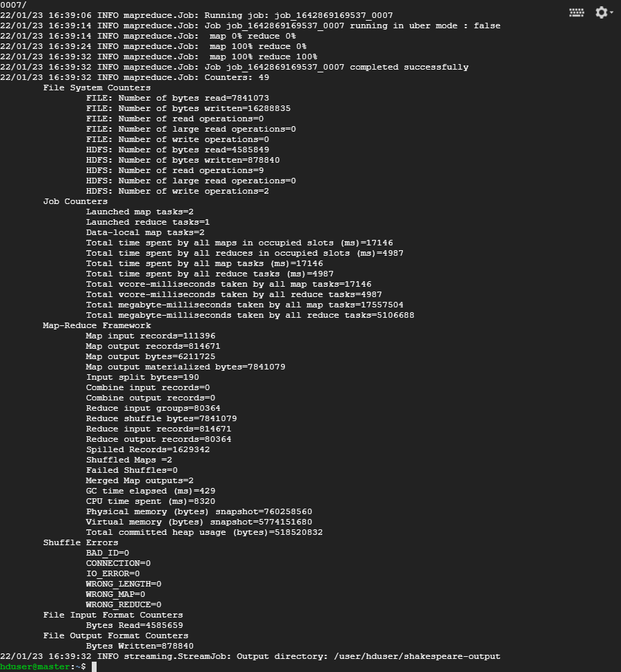

  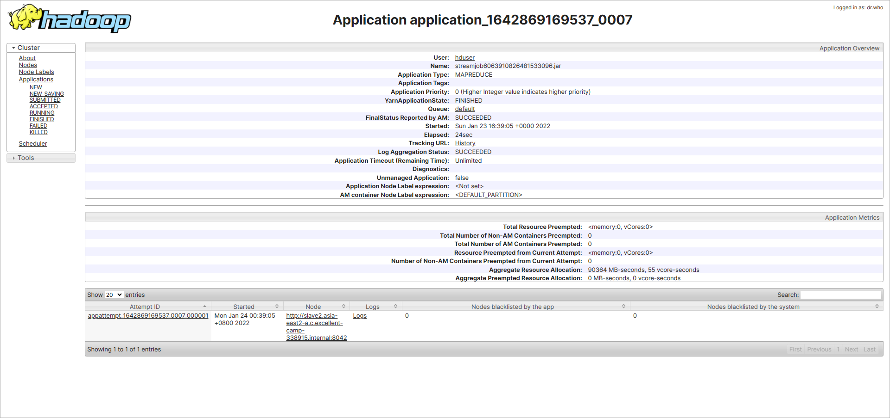

  The total running time is **24s**

- **Checking the WordCount Result**

  ```shell
  hduser@master:~$ hadoop dfs -copyToLocal /user/hduser/shakespeare-output /home/hduser
  ```

  -Download and Open part-00000 file locally as follows:

  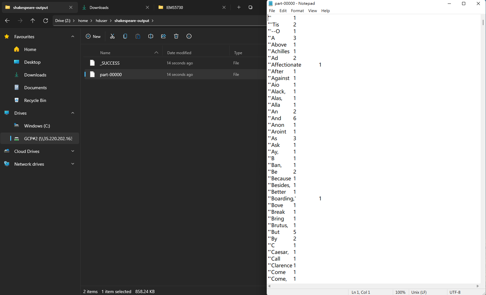

## **Part d[Bonus 10 Marks]** Compiling the Java WordCount program for MapReduce[^14]

- **Adding the HADOOP_CLASSPATH into the environment**

  ```shell
  hduser@master:~$ echo 'export HADOOP_CLASSPATH=${JAVA_HOME}/lib/tools.jar' >> /home/hduser/.bashrc
  hduser@master:~$ source /home/hduser/.bashrc
  ```

- **Creating WordCount.java and save it to /home/hduser**

  ```java
  import java.io.IOException;
  import java.util.StringTokenizer;
  
  import org.apache.hadoop.conf.Configuration;
  import org.apache.hadoop.fs.Path;
  import org.apache.hadoop.io.IntWritable;
  import org.apache.hadoop.io.Text;
  import org.apache.hadoop.mapreduce.Job;
  import org.apache.hadoop.mapreduce.Mapper;
  import org.apache.hadoop.mapreduce.Reducer;
  import org.apache.hadoop.mapreduce.lib.input.FileInputFormat;
  import org.apache.hadoop.mapreduce.lib.output.FileOutputFormat;
  
  public class WordCount {
  
    public static class TokenizerMapper
         extends Mapper<Object, Text, Text, IntWritable>{
  
      private final static IntWritable one = new IntWritable(1);
      private Text word = new Text();
  
      public void map(Object key, Text value, Context context) throws IOException, InterruptedException {
        StringTokenizer itr = new StringTokenizer(value.toString());
        while (itr.hasMoreTokens()) {
          word.set(itr.nextToken());
          context.write(word, one);
        }
      }
    }
  
    public static class IntSumReducer extends Reducer<Text,IntWritable,Text,IntWritable> {
      private IntWritable result = new IntWritable();
  
      public void reduce(Text key, Iterable<IntWritable> values, Context context) throws IOException, InterruptedException {
        int sum = 0;
        for (IntWritable val : values) {
          sum += val.get();
        }
        result.set(sum);
        context.write(key, result);
      }
    }
  
    public static void main(String[] args) throws Exception {
      Configuration conf = new Configuration();
      Job job = Job.getInstance(conf, "word count");
      job.setJarByClass(WordCount.class);
      job.setMapperClass(TokenizerMapper.class);
      job.setCombinerClass(IntSumReducer.class);
      job.setReducerClass(IntSumReducer.class);
      job.setOutputKeyClass(Text.class);
      job.setOutputValueClass(IntWritable.class);
      FileInputFormat.addInputPath(job, new Path(args[0]));
      FileOutputFormat.setOutputPath(job, new Path(args[1]));
      System.exit(job.waitForCompletion(true) ? 0 : 1);
    }
  }
  ```

- **Compile and Create a jar**

  ```shell
  hduser@master:~$ hadoop com.sun.tools.javac.Main WordCount.java
  hduser@master:~$ jar cf wc.jar WordCount*.class
  ```

- **Execute the wc.jar on Hadoop**

  ```shell
  hduser@master:~$ hadoop jar wc.jar WordCount /user/hduser/shakespeare /user/hduser/shakespeare-output-java
  ```

  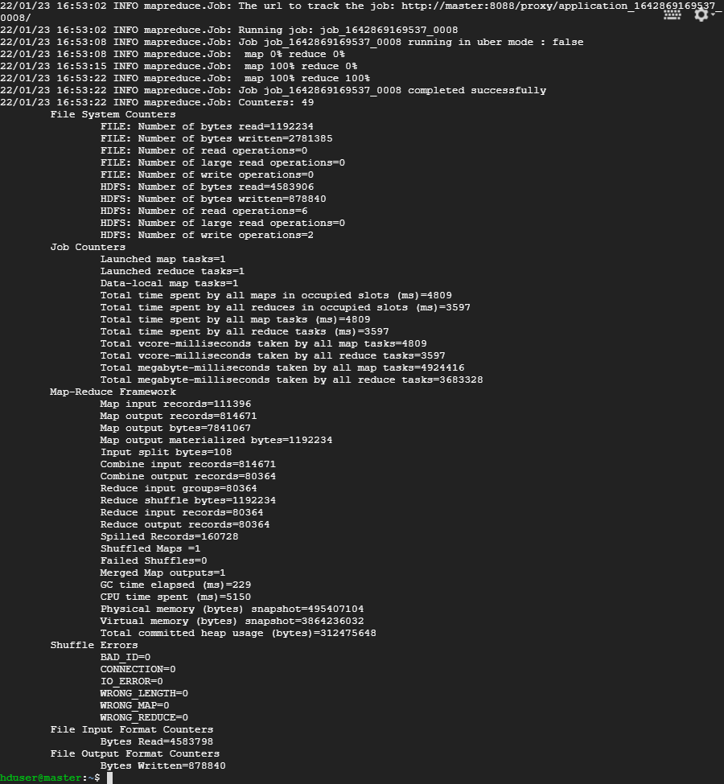

  

  Can see from the nodemanager that total running time is **19s** ,5s faster than python streaming.

- **Checking the WordCount Output**

  ```shell
  hduser@master:~$ hadoop dfs -copyToLocal /user/hduser/shakespeare-output-java /home/hduser
  ```

  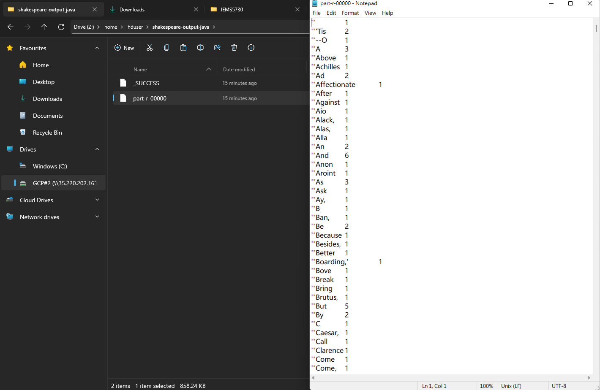

## **Reference**

[^1]: Installing Java On Linux: https://www.cnblogs.com/samcn/archive/2011/03/16/1986248.html
[^2]: Tutorial 2 (cuhk.edu.hk): http://mobitec.ie.cuhk.edu.hk/ierg4300Fall2021/tutorial/tutorial2/
[^3]: Single-Node Hadoop Setup(hadoop.apache.org): https://hadoop.apache.org/docs/r2.9.2/hadoop-project-dist/hadoop-common/SingleCluster.html
[^4]: TeraSort Package(hadoop.apache.org): https://hadoop.apache.org/docs/r2.9.2/api/org/apache/hadoop/examples/terasort/package-summary.html
[^5]: Setting Up Multi-Node Cluster General Guide: https://www.michael-noll.com/tutorials/running-hadoop-on-ubuntu-linux-multi-node-cluster/
[^6]: Configuring Multi-Node Cluster(Video): https://www.youtube.com/watch?v=S9AZBVIWWDI
[^7]: Building passphraseless SSH connection among nodes(Video): https://www.youtube.com/watch?v=4eBtwf_AcaQ&t=702s
[^8]: Configuring Multi-Node Cluster: https://github.com/vibiks/gcp
[^9]: Running Python Code on Hadoop: https://www.michael-noll.com/tutorials/writing-an-hadoop-mapreduce-program-in-python/
[^10]: Python2.7-Configuration: https://blog.csdn.net/qq_40907977/article/details/102959714
[^11]: ErrorCode127- https://blog.csdn.net/m0_46108436/article/details/106458163
[^12]: Hadoop-Streaming-2.9.2's Location: https://www.cnblogs.com/zyb993963526/p/10575640.html
[^13]: Hadoop-Streaming-2.9.2.jar Command: https://hadoop.apache.org/docs/r2.9.2/hadoop-streaming/HadoopStreaming.html
[^14]: Apache-Map-Reduce-Tutorial: https://hadoop.apache.org/docs/stable/hadoop-mapreduce-client/hadoop-mapreduce-client-c ore/MapReduceTutorial.html

