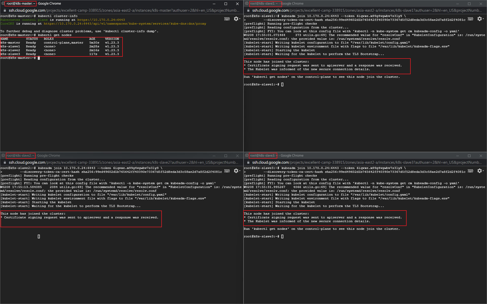

<h1 align=center>IEMS5730 Spring2022 Homework#1</h1>

<p align=center>LIU Zijian 1155162635</p>

<h2 align=center>Declaration</h2>


[TOC]

## **Part a[20 Marks]** Single-node Kubernetes Cluster Setup

- Root

  ```shell
  $ sudo -i
  ```

- Docker Installation[^1]

  ```shell
  $ sudo apt-get update
  $ sudo apt-get install ca-certificates curl gnupg lsb-release
  $ curl -fsSL https://download.docker.com/linux/ubuntu/gpg | sudo gpg --dearmor -o /usr/share/keyrings/docker-archive-keyring.gpg
  $ echo "deb [arch=$(dpkg --print-architecture) signed-by=/usr/share/keyrings/docker-archive-keyring.gpg] https://download.docker.com/linux/ubuntu /
    $(lsb_release -cs) stable" | sudo tee /etc/apt/sources.list.d/docker.list > /dev/null
  $ sudo apt-get update
  $ sudo apt-get install docker-ce docker-ce-cli containerd.io -y
  ```

- `kubeadm` `kubectl` `kubelet` installation

  ```shell
  $ sudo apt-get update
  $ sudo apt-get install -y apt-transport-https ca-certificates curl
  $ sudo curl -fsSLo /usr/share/keyrings/kubernetes-archive-keyring.gpg https://packages.cloud.google.com/apt/doc/apt-key.gpg
  $ echo "deb [signed-by=/usr/share/keyrings/kubernetes-archive-keyring.gpg] https://apt.kubernetes.io/ kubernetes-xenial main" | sudo tee /etc/apt/sources.list.d/kubernetes.list
  $ sudo apt-get update
  $ sudo apt-get install -y kubelet kubeadm kubectl
  $ sudo apt-mark hold kubelet kubeadm kubectl
  ```

- Disable Firewall and Swap, Restart the instance

  ```shell
  $ sudo ufw disable
  $ sudo swapoff -a; sed -i '/swap/d' /etc/fstab
  ```

- cgroup Configuartion*[^6]

  `Kubernetes` cgroup driver was set to `systems` but `docker` was set to `systemd`. So create a config file named `/etc/docker/daemon.json` and added below:

  ```json
  {
      "exec-opts": ["native.cgroupdriver=systemd"]
  }
  ```

  Then

  ```shell
  $ sudo systemctl daemon-reload
  $ sudo systemctl restart docker
  $ sudo systemctl restart kubelet
  ```

- Letting iptables see bridged traffic 

  ```shell
  $ cat <<EOF | sudo tee /etc/modules-load.d/k8s.conf
  br_netfilter
  EOF
  
  $ cat <<EOF | sudo tee /etc/sysctl.d/k8s.conf
  net.bridge.bridge-nf-call-ip6tables = 1
  net.bridge.bridge-nf-call-iptables = 1
  EOF
  
  $ sudo sysctl --system
  ```

- Start & Init

  ```shell
  $ echo 1 > /proc/sys/net/ipv4/ip_forward
  $ kubeadm init
  ```

  Output:

  

- Config `kubectl`  as `root`

  ```shell
  export KUBECONFIG=/etc/kubernetes/admin.conf
  ```

- Deploy a pod network to the cluster

  ```shell
  $ kubectl apply -f https://docs.projectcalico.org/manifests/calico.yaml
  ```

- Control-Pane Node Isolation

  ```shell
  $ kubectl taint nodes --all node-role.kubernetes.io/master-
  ```

- Checking the states with `kubectl`

  ```shell
$ kubectl cluster-info
  $ kubectl get nodes
  ```
  
  

- Running the `helloworld` program

  ```shell
  $ kubectl apply -f https://mobitec.ie.cuhk.edu.hk/iems5730/static_files/assignments/hello-world-demo.yaml
  ```

  Check the pod status
  
  
  
  Screenshot Result 
  
  

## **Part b[40 Marks]** Multi-node Kubernetes Cluster Setup

- Setting up VMs as part a

  Create a machine image with `docker` and `kubeadm` `kubectl` `kubelet` installed and configured, and generate 4 new VM instances(1 master + 3 slaves) with the image, in the same regional network under GCP

  

- For `master`, log in as `root`, and then run:

  ```shell
  $ kubeadm init
  ```

  With output like:

  

  Then, config the `kubectl`  + set up `calico` pod network + untaint master node

  ```shell
  $ export KUBECONFIG=/etc/kubernetes/admin.conf
  $ kubectl apply -f https://docs.projectcalico.org/manifests/calico.yaml
  $ kubectl taint nodes --all node-role.kubernetes.io/master-
  ```

- For `slaves`, log in as `root`, and then run as the `kubeadm init` output indicates:

  ```shell
  $ kubeadm join 10.170.0.24:6443 --token 6iqvxe.m99g4vgwbv7s3ly9 /
          --discovery-token-ca-cert-hash sha256:99ed49602d1b765642ff40390e73367d5f52d8eda3d3c58ae2d7a8f2d2f4081c 
  ```

  Checking the cluster state with `kubectl`

  ```shell
  $ kubectl cluster-info
  $ kubectl get nodes
  ```

  Final output

  

- Deploy `hadoop.yaml`

  ```shell
  $ kubectl create -f https://mobitec.ie.cuhk.edu.hk/ierg4330/static_files/assignments/hadoop.yaml
  ```

- Enter the command line of `master` pod, run terasort program with Hadoop on k8s

  ```shell
  $ kubectl exec --stdin --tty hdfs-master -- /bin/bash
  $ cd /usr/local/hadoop
  # Terasort 2GB Example
  $ ./bin/hadoop jar ./share/hadoop/mapreduce/hadoop-mapreduce-examples-2.7.2.jar teragen 20000000 terasort/input2GB
  $ ./bin/hadoop jar ./share/hadoop/mapreduce/hadoop-mapreduce-examples-2.7.2.jar terasort terasort/input2GB terasort/output2GB
  $ ./bin/hadoop jar ./share/hadoop/mapreduce/hadoop-mapreduce-examples-2.7.2.jar teravalidate terasort/output2GB terasort/check2GB
  # Terasort 20GB Example
  $ ./bin/hadoop jar ./share/hadoop/mapreduce/hadoop-mapreduce-examples-2.7.2.jar teragen 200000000 terasort/input20GB 
  $ ./bin/hadoop jar ./share/hadoop/mapreduce/hadoop-mapreduce-examples-2.7.2.jar terasort terasort/input20GB terasort/output20GB
  $ ./bin/hadoop jar ./share/hadoop/mapreduce/hadoop-mapreduce-examples-2.7.2.jar teravalidate terasort/output20GB terasort/check20GB 
  ```

- Result & Runtime, from YARN application manager via `port 32088`

  

  2GB: TeraGen(32s) + Terasort(157s) + TeraValidate(34s) = 223s 

  20GB: TeraGen(248s) + Terasort(15322s) + TeraValidate(485s) = 16055s


## **Part c[20 Marks]** Serverless Kubernetes Service with gcloud CLI

- Create a k8s cluster manually with the WebUI on Google Cloud Console, with config as follows[^2][^3]:

  /- Basics: standard mode, named as k8s-serverless

  /- Nodesize: 3 ~~4 (different from the homework instructions, stay the same as part b, the yaml file will configure 3 nodes anyway~~)

  /- Nodetype: n1-standard-2, 100GB harddisk

  | Basics                                         | Nodesize                                                   | Nodetype                                         |
  | ---------------------------------------------- | ---------------------------------------------------------- | ------------------------------------------------ |
  |  |  |  |

- Access & Authorize the k8s cluster with <u>Cloud Shell</u>, checking the cluster status

  ```shell
  $ gcloud container clusters get-credentials k8s-serverless --zone asia-east1-a --project excellent-camp-338915
  ```

  

- Deploy `hadoop.yaml`

  ```shell
  $ kubectl create -f https://mobitec.ie.cuhk.edu.hk/ierg4330/static_files/assignments/hadoop.yaml
  ```

  Configure firewall on GCloud console panel, Checking the external IP address of `hdfs-master`: 35.225.109.6

  

  Entering the `hadoop-hdfs-master` WebUI panel via `port 32007`: http://35.225.109.6:32007

  

- Enter the command line of `hdfs-master` pod, run terasort program with Hadoop on k8s-serverless

  ```shell
  $ kubectl exec --stdin --tty hdfs-master -- /bin/bash
  $ cd /usr/local/hadoop
  # Terasort 2GB Example
  $ ./bin/hadoop jar ./share/hadoop/mapreduce/hadoop-mapreduce-examples-2.7.2.jar teragen 20000000 terasort/input2GB
  $ ./bin/hadoop jar ./share/hadoop/mapreduce/hadoop-mapreduce-examples-2.7.2.jar terasort terasort/input2GB terasort/output2GB
  $ ./bin/hadoop jar ./share/hadoop/mapreduce/hadoop-mapreduce-examples-2.7.2.jar teravalidate terasort/output2GB terasort/check2GB
  # Terasort 20GB Example
  $ ./bin/hadoop jar ./share/hadoop/mapreduce/hadoop-mapreduce-examples-2.7.2.jar teragen 200000000 terasort/input20GB 
  $ ./bin/hadoop jar ./share/hadoop/mapreduce/hadoop-mapreduce-examples-2.7.2.jar terasort terasort/input20GB terasort/output20GB
  $ ./bin/hadoop jar ./share/hadoop/mapreduce/hadoop-mapreduce-examples-2.7.2.jar teravalidate terasort/output20GB terasort/check20GB 
  ```

  Runtime Screenshot (Take `teragen` 2GB for example)

  | Cloud Shell Terminal                                    | Yarn Application Manager                         |
  | ------------------------------------------------------- | ------------------------------------------------ |
  |  |  |

  Runtime & Result:

  

  2GB: TeraGen(36s) + Terasort(126s) + TeraValidate(32s) = 194s

  20GB: TeraGen(245s) + Terasort(10841s) + TeraValidate(171s) = 11257s


## **Part d[20 Marks]** YARN vs. Multi-node Kubernetes vs. Serverless Kubernetes

- Runtime Performance Comparison (seconds)

  /- 2GB

  |                    | TeraGen | TeraSort | TeraValidate | Total |
  | ------------------ | ------- | -------- | ------------ | ----- |
  | **YARN**           | 35      | 93       | 28           | 156   |
  | **Multi-Node k8s** | 32      | 157      | 34           | 223   |
  | **Serverless k8s** | 36      | 126      | 32           | 194   |

  /- 20GB

  |                    | TeraGen | TeraSort | TeraValidate | Total |
  | ------------------ | ------- | -------- | ------------ | ----- |
  | **YARN**           | 192     | 14416    | 192          | 14800 |
  | **Multi-Node k8s** | 248     | 15322    | 385          | 16055 |
  | **Serverless k8s** | 245     | 10841    | 171          | 11257 |

- Observations[^5]

  Overall, Hadoop within k8s performs less efficient then Hadoop within YARN. An important prerequisite is that since the data generated by `teragen` program are stored locally on respective pods/VMs (didn't actually transmit the generated data but the status and programs), so the difference in performance mainly lies in the exchange efficiency of the commands / instrutions / status info among the namenode and the datanodes. 
  
  /- <u>YARN</u>: Namenode and datanode are located on different VMs, and the traffic among namenode and datanodes are carried via the network connecting the VMs, in this case, ... . 
  
  /- <u>Multi-Node k8s</u>: Namenode and each datanode was virtualized into a pod, and the traffic among pods are carried via an extra virtual network layer compared with YARN (in this case, the Calico CNI[^4] ), which induces additional routings and unnecessary delays, hence performs the worst. 
  
  /- <u>Serverless k8s</u>: The GKE uses a different network configuration among the pods, and provides a more efficient management platform along with multiple add-on services for k8s clusters.[^4][^7] , especially in terms of network exchange efficiency, hence reducing the price of communication among pods. And this makes pods traffic among serverless k8s pods more efficient and the cluster performs better than multi-node k8s and even better than YARN somtimes(e.g. 20GB `terasort` program) under the same type of machines.
  
  

## **Part e[10 bonus]** Fault-tolerance in YARN and Kubernetes

- Kill the 'hello-world' program and describe & explain observations.

  ```shell
  $ kubectl get pods -o wide
  $ kubectl delete pods hello-world-kkn2r
  $ kubectl get pods -o wide
  ```

  After deleting the `hello-world-kkn2r` pod, another pod named `hello-world-5w5lg` with a different internal IP emerged after seconds.

  

  Checking `kubectl get events`: A new app was created and scheduled to replace the deleted `hello-world `app, the same time as the old one dies. And since there're 2 replicas according to the `hello-world-demo.yaml` file, after the first container dies, the second container (in this case, pod named `hello-world-xplmz`) would come as backup and put into production to support the app function seamlessly despite failure of original container.

  

  

- Kill the 'terasort 20GB' program and describe & explain observations[^8][^9].

  Re-run the 20GB terasort program

  ```shell
  $ kubectl exec --stdin --tty hdfs-master -- /bin/bash
  $ cd /usr/local/hadoop
  $ ./bin/hadoop jar ./share/hadoop/mapreduce/hadoop-mapreduce-examples-2.7.2.jar terasort terasort/input20GB terasort/output20GB-2
  ```

  

  Open another Cloud Shell terminal,kill `hadoop-datanode-3` `yarn-node-3` ,run and check the status of the pod

  ```shell
  $ kubectl get pods -o wide
  $ kubectl delete pods hadoop-datanode-3 yarn-node-3
  $ kubectl get pods -o wide
  ```

  

  Open another terminal and track the locality of each mapper/reducer by monitoring the logging of `yarn-master`, as well as the Yarn WebUI via `port 32088`, but cannot track the running application logs since the container port for TrackingUI is not open in the given `hadoop.yaml`

  ```shell
  $ kubectl logs -f yarn-master
  ```

  WebUI & Shell Logs: After deleting `Yarn-node-3`, Yarn reselect `yarn-node-1` as scheduler to restart the job, after a timout of 600s(10 min), which corresponds to the WebUI records and log output.  And the job was restarted to run from scratch.

    

    

  Also check k8s event logs from `kubectl get events`, note that the pods didn't restart after deleting this time, since there's no replicas.

  

  To sum up, in this containerized hadoop, the fault tolerance was mainly realized by Yarn to reschedule the running job properly without the deleted pods restarted. This could be imagined as shutting down a VM during a MapReduce job running on manually configured / provisioned hadoop over multiple clusters. 

## **Reference**

[^1]:gcloud CLI download, install and init: https://cloud.google.com/sdk/docs/install
[^2]:Set up GKE with gcloud CLI - Quickstart: https://cloud.google.com/kubernetes-engine/docs/quickstart?cloudshell=true
[^3]: Set up GKE with gcloud console webUI: https://www.youtube.com/watch?v=3EF4fXZcTDg

[^4]:k8s networking on GCP: https://www.tigera.io/blog/everything-you-need-to-know-about-kubernetes-networking-on-google-cloud/

[^5]:HDFS on kubernetes: https://databricks.com/session/hdfs-on-kubernetes-lessons-learned
[^6]:docker config on kubeadm: https://stackoverflow.com/questions/52119985/kubeadm-init-shows-kubelet-isnt-running-or-healthy

[^7]: Difference Between GKE and K8s: https://stackoverflow.com/questions/37904711/what-is-the-difference-between-kubernetes-and-gke#:~:text=In%20short%20Kubernetes%20does%20the,integrated'%20with%20the%20Google%20portal.

[^8]:kubectl logs command cheat sheet: https://jamesdefabia.github.io/docs/user-guide/kubectl/kubectl_logs/
[^9]:kubectl cheat sheet: https://kubernetes.io/docs/reference/kubectl/cheatsheet/


