<h1 align="center">IEMS5730 Spring2022 Homework#2</h1>

<p align=center>1155162635 LIU Zijian</p>

<h2 align=center>Declaration</h2>


[TOC]


## **Q1 [30 + 5 Marks]Basic Operations of Pig** [^1][^2]

### **(a) [5 Bonus]** Install Pig upon Hadoop cluster

Download Pig and unzip the folder under `/usr/local/pig` (release 0.17.0)

```shell
hduser@master:~$ wget http://ftp-stud.hs-esslingen.de/pub/Mirrors/ftp.apache.org/dist/pig/pig-0.17.0/pig-0.17.0.tar.gz
hduser@master:~$ tar -xvzf pig-0.17.0.tar.gz
hduser@master:~$ sudo mv pig-0.17.0 /usr/local/pig
```

Adding the `/usr/local/pig/bin` to path

```shell
hduser@master:~$ echo 'export PIG_HOME=/usr/local/pig' >> /home/hduser/.bashrc
hduser@master:~$ echo 'export PATH=$PATH:$PIG_HOME/bin' >> /home/hduser/.bashrc
hduser@master:~$ source /home/hduser/.bashrc
```

Check the installation with `pig -help` command

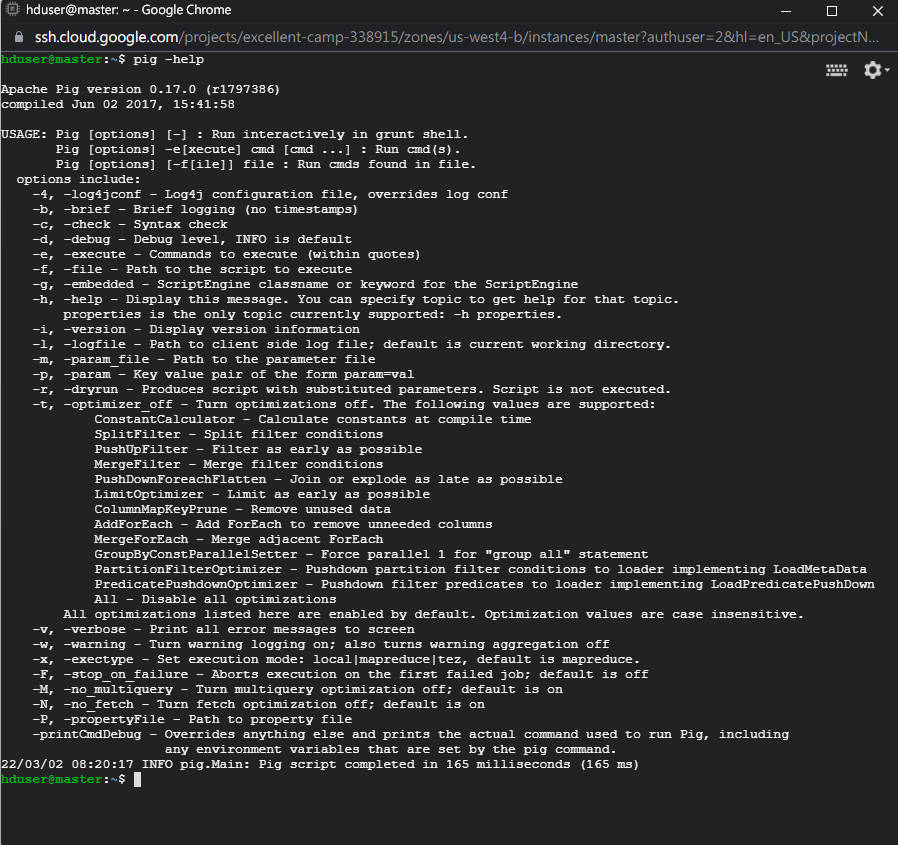

### **(b) [5 Marks]** Upload to HDFS & Join them into one table 

Set the `PIG_CLASSPATH` environment to the cluster configuration directory

```shell
hduser@master:~$ echo 'export PIG_CLASSPATH=/usr/local/hadoop/etc/hadoop' >> /home/hduser/.bashrc
hduser@master:~$ source /home/hduser/.bashrc
```

Download the file, unzip and upload to hdfs 

```shell
hduser@master:~$ wget http://storage.googleapis.com/books/ngrams/books/googlebooks-eng-all-1gram-20120701-a.gz
hduser@master:~$ wget http://storage.googleapis.com/books/ngrams/books/googlebooks-eng-all-1gram-20120701-b.gz
hduser@master:~$ gzip -d googlebooks-eng-all-1gram-20120701-a.gz
hduser@master:~$ gzip -d googlebooks-eng-all-1gram-20120701-b.gz
hduser@master:~$ hadoop dfs -copyFromLocal googlebooks-eng-all-1gram-20120701-a /user/hduser/gbook-a
hduser@master:~$ hadoop dfs -copyFromLocal googlebooks-eng-all-1gram-20120701-b /user/hduser/gbook-b
```

Invoking the `grunt` shell

```shell
hduser@master:~$ pig -x mapreduce
```

Write Pig scripts directly in `grunt` shell to join the two file into one table

```shell
grunt> a = LOAD 'hdfs://master:54310/user/hduser/gbook-a' 
		   USING PigStorage('/t') 
		   AS (bigram:chararray,year:int,match_count:int,volume_count:int);
grunt> b = LOAD 'hdfs://master:54310/user/hduser/gbook-b' 
		   USING PigStorage('/t') 
		   AS (bigram:chararray,year:int,match_count:int,volume_count:int);
grunt> c = UNION a,b;
grunt> STORE c INTO 'hdfs://master:54310/user/hduser/gbook-all' USING PigStorage('/t');
```

Execution result

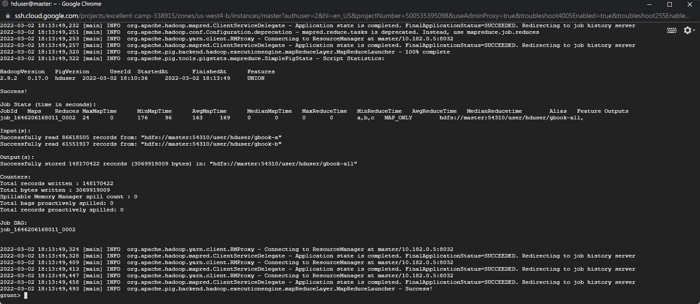

Validation

/- using `cd ` `ls` to check the result, and `fs -getmerge` command to aggregate the output of (b) into a single file

/- Checking if line number of the combined table equals the sum of the two original files: 86618505(a) + 61551917(b) = 148170422(all)

```shell
grunt> fs -getmerge -nl /user/hduser/gbook-all /home/hduser/gbook-all-res
hduser@master:~$ cat gbook-all-res | head -n 10
hduser@master:~$ wc -l gbook-all-res
hduser@master:~$ wc -l googlebooks-eng-all-1gram-20120701-a 
hduser@master:~$ wc -l googlebooks-eng-all-1gram-20120701-b
```

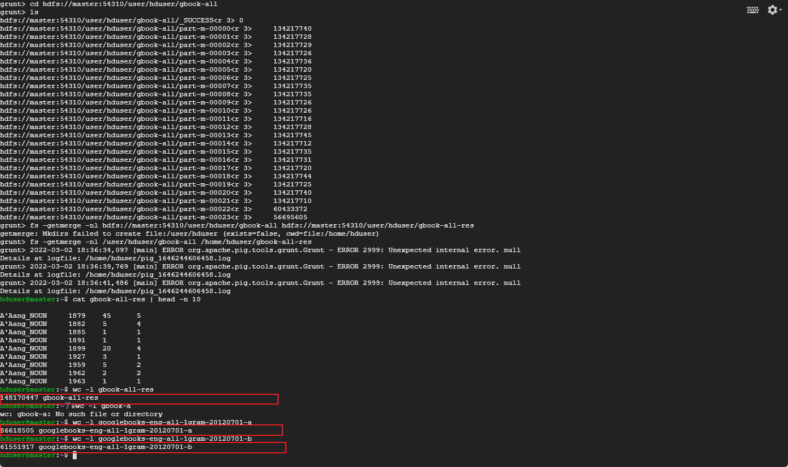

### **(c)(d) [10+15 Marks]** Calculate average number of occurences per year for each bigram 

Upload the combined data to HDFS

```shell
hduser@master:~$ hadoop dfs -copyFromLocal gbook-all-res /user/hduser/gbook-all-res
```

Write the Pig script as follows and save it to `bigram_occ_per_year.pig`

/* <u>Statement: to avoid the case of 1 record didn't correspond to 1 year, I didn't use `AVG` function</u>

```shell
data = LOAD 'hdfs://master:54310/user/hduser/gbook-all-res' 
       USING PigStorage('/t') 
       AS (bigram:chararray,year:int,match_count:int,volume_count:int);
data_groups = GROUP data BY bigram;
occ_per_year = FOREACH data_groups{
				unique_year = DISTINCT data.year;
				year_count = COUNT(unique_year);
				total_match_count = SUM(data.match_count);
				GENERATE group, (float)total_match_count/year_count AS avg_match_count;
			   }
occ_per_year_desc = ORDER occ_per_year BY avg_match_count DESC;
result = LIMIT occ_per_year_desc 20;
DUMP result;
STORE occ_per_year INTO 'hdfs://master:54310/user/hduser/pig_result' USING PigStorage('/t');
```

Execute the script via `pig -x mapreduce *.pig` command

```shell
hduser@master:~$ pig -x mapreduce bigram_occ_per_year.pig
```

Results Screenshots and Runtime(693.844s)

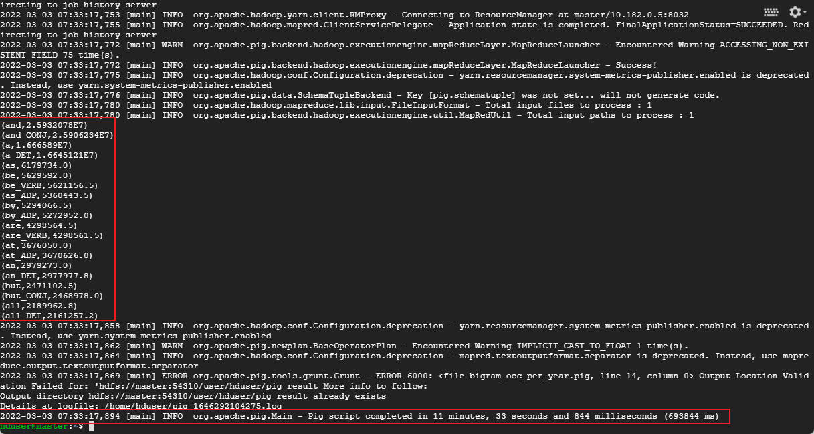


## **Q2 [30 + 5 Marks] Basic Operations of Hive**

### **(a) [5 Bonus]** Install Hive upon Hadoop cluster[^3][^4][^5][^6]

Download `Hive` and Unzip to `/usr/local/hive` (Release 2.3.9)

```shell
hduser@master:~$ wget https://dlcdn.apache.org/hive/hive-2.3.9/apache-hive-2.3.9-bin.tar.gz
hduser@master:~$ tar -zxvf apache-hive-2.3.9-bin.tar.gz
hduser@master:~$ sudo mv apache-hive-2.3.9-bin /usr/local/hive
```

Set the environment variable `HIVE_HOME`

```shell
hduser@master:~$ echo 'export HIVE_HOME=/usr/local/hive' >> ./.bashrc
hduser@master:~$ echo 'export PATH=$HIVE_HOME/bin:$PATH' >> ./.bashrc
hduser@master:~$ source ./.bashrc
```

Create necessary folders/locations

```shell
hduser@master:~$ hadoop dfs -mkdir /tmp
hduser@master:~$ hadoop dfs -mkdir /user/hive/warehouse
hduser@master:~$ hadoop dfs -chmod g+w /tmp
hduser@master:~$ hadoop dfs -chmod g+w /user/hive/warehouse
```

Configuring metastore[^4]

/- Install & Configure `mysql` on master/namenode

```shell
hduser@master:~$ sudo apt-get install mysql-server
```

```mysql
ALTER USER 'root'@'localhost' IDENTIFIED WITH mysql_native_Password BY "1155162635";
FLUSH PRIVILEGES;
CREATE DATABASE hive;
GRANT ALL PRIVILEGES on *.* to root@localhost;
```

/- Create `hive-site.xml` under `$HIVE_HOME/conf`

```xml
<?xml version="1.0" encoding="UTF-8" standalone="no"?>
<?xml-stylesheet type="text/xsl" href="configuration.xsl"?>
<configuration>
        <property>
                <name>javax.jdo.option.ConnectionURL</name>
                <value>jdbc:mysql://localhost:3306/hive</value>
        </property>

        <property>
                <name>javax.jdo.option.ConnectionDriverName</name>
                <value>com.mysql.cj.jdbc.Driver</value>
        </property>

        <property>SS
                <name>javax.jdo.option.ConnectionUserName</name>
                <value>root</value>
        </property>

        <property>
                <name>javax.jdo.option.ConnectionPassword</name>
                <value>1155162635</value>
        </property>

        <property>
                <name>hive.metastore.schema.verification</name>
                <value>false</value>
        </property>
</configuration>
```

/- Download `mysql-connector` jar package and copy it under `$HIVE_HOME/lib`[^6]

```shell
hduser@master:~$ sudo cp mysql-connector-java-8.0.27.jar /usr/local/hive/lib
```

/- Initialize the mysql database for metastore

```shell
hduser@master:~$ schematool -dbType mysql -initSchema
```

Checking `hive --version` and Entering the CLI via `hive`

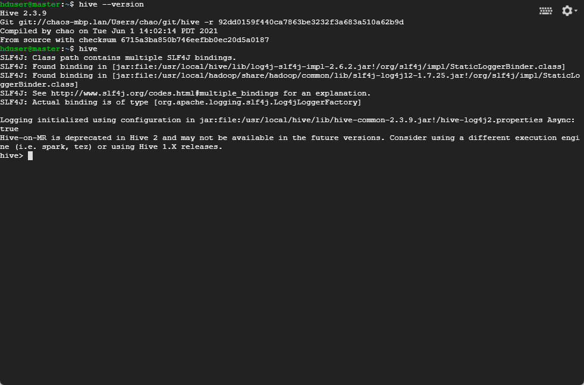

/- Create a database `hw2` in `hive` and See the metastore info from mysql

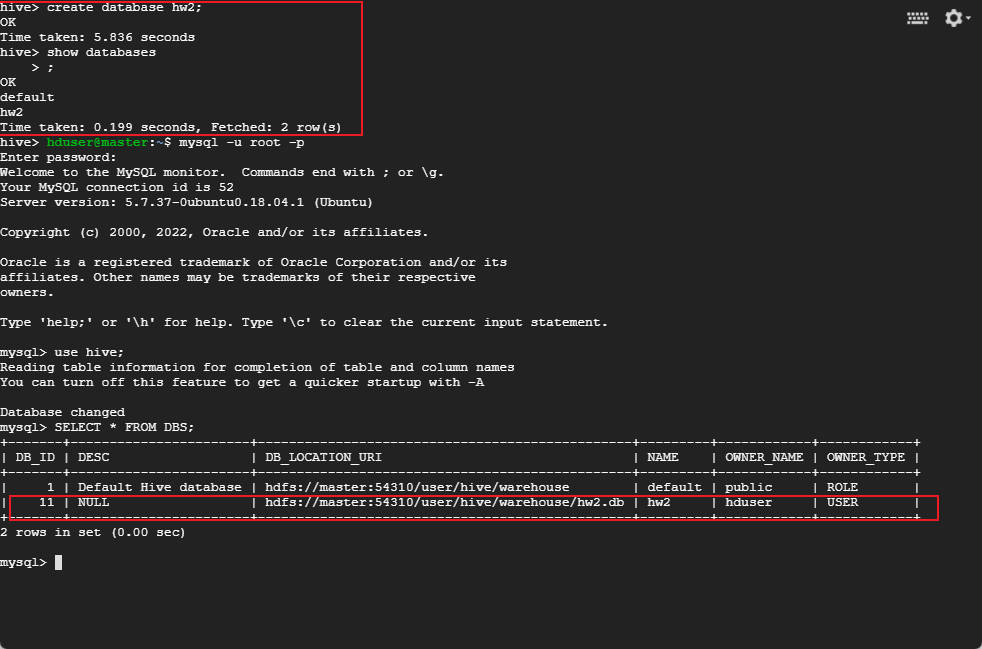

### **(b) [30 Marks]** Calculate yearly average occurence of bigrams with Hive

<u>USE</u> the database `hw2`

```sql
USE hw2;
```

<u>CREATE</u> a table schema to fit the data, with no `PARTITIONED BY` specified

```sql
CREATE TABLE if not exists gbook_data(
    bigram STRING,
    year INT,
    match_count INT,
    volume_count INT)
COMMENT 'hw2_q2_data'
ROW FORMAT DELIMITED
FIELDS TERMINATED BY '/t'
LINES TERMINATED BY '/n'
STORED AS TEXTFILE;
```

<u>LOAD</u> ~~the two parts of data sparately and joining into one table~~ the data from Q1(b)

```sql
/* Load from two parts */
-- LOAD DATA INPATH 'hdfs://master:54310/user/hduser/gbook-a' OVERWRITE INTO TABLE gbook_data;
-- LOAD DATA INPATH 'hdfs://master:54310/user/hduser/gbook-b' INTO TABLE gbook_data;

/* Stays in consistency with PIG scripts, for better performance comparison*/
LOAD DATA INPATH 'hdfs://master:54310/user/hduser/gbook-all-res' OVERWRITE INTO TABLE gbook_data;
```

Check & Inspect the integrity/functionality of the instances

```sql
SELECT COUNT(*) FROM gbook_data;
SELECT * FROM gbook_data LIMIT 20;
SELECT * FROM gbook_data WHERE year>2000 LIMIT 10;
```

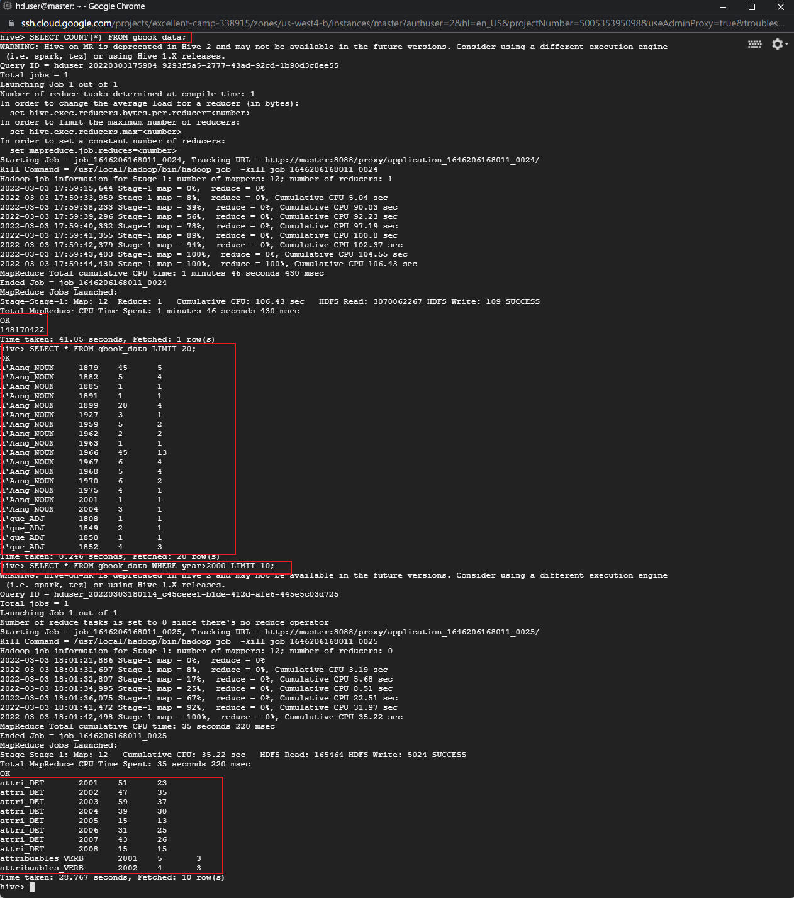

Write HiveQL, and execute the query directly in Hive CLI to calculate the occurance per year. 

The program adopts `SUM()/ COUNT(DISTINCT *)` instead of `AVG()`, staying inline with my PIG script's design logic, for better comparison.

```sql
SELECT
    bigram,
    SUM(match_count)/COUNT(DISTINCT year) AS occ_per_year
FROM gbook_data
GROUP BY bigram
ORDER BY occ_per_year DESC
LIMIT 20;
```

Result and Total Runtime: 381.731 seconds

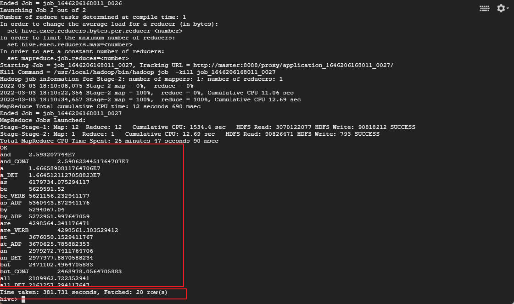

Rerun Pig-Script, and compared hive with Pig Performance: 

|            | PIG Latin | HIVE    |
| ---------- | --------- | ------- |
| Runtime(s) | 573.332   | 381.731 |
| MR Jobs    | 4         | 2       |

Theorectically, Pig has a higher performance benchmarking compared with HIVE.  

However, in this case, PIG is slower than HIVE, since PIG schedules 2 more MR jobs to finish the task according to the output logs, which might be largely due to that HIVE interprets my `SUM()/ COUNT(DISTINCT *) ` logic more efficiently than my step-by-step disintegration in the `FOREACH` loop of my PIG script.

> Answer from tutorial:
>
> - Stuctured data in Hive and semi-structured data in PIG: Naturally, deriving an execution plan on a structured data can be done more efficiently(more information for the planner). An analogy for this is just like how <u>compiled programming language</u> runs faster than the <u>interpreted one</u>
> - Scheduling and optimization


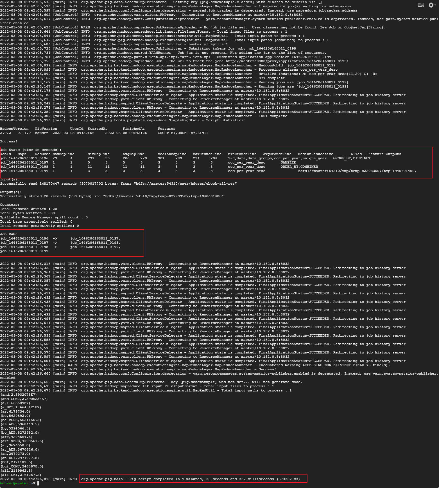


## **Q3 [40 Marks+ 20 Bonus] Similar User Detection Using Pig & Hive**

### **(a) [15 Marks]** Query the number of movies users both watched on the two dataset

**Prerequisite**

/- Download the movielens data and upload to HDFS, Entering the grunt shell

```shell
$ wget https://mobitec.ie.cuhk.edu.hk/ierg4330/static_files/assignments/movielens_small.csv
$ wget https://mobitec.ie.cuhk.edu.hk/ierg4330/static_files/assignments/movielens_large_updated.csv
$ hadoop dfs -copyFromLocal movielens_small.csv /user/hduser/movielens_small
$ hadoop dfs -copyFromLocal movielens_large_updated.csv /user/hduser/movielens_large
```

**Small Dataset**

/- Pig Scripts for small dataset: `cmn_movie_count_small.pig`

```sql
/************************************************************************	
    HW2 Q3(a): CALCULATING COMMON MOVIES WATCHED BY PAIRS OF USERS
*************************************************************************/

-- LOAD THE DATA: 2 Copies
data1 = LOAD 'movielens_small' USING PigStorage(',') AS (userid1:int,movieid1:int);
data2 = LOAD 'movielens_small' USING PigStorage(',') AS (userid2:int,movieid2:int);

-- SELF INNER JOIN ON `MOVIES`: to compute each pair of fans of any movie 
cmn_movies = JOIN data1 by movieid1, data2 BY movieid2;
cmn_movies_notself = FILTER cmn_movies BY userid1!=userid2;

-- GROUP THE DATA: (user1,user2,{bag of common movies watched})
cmn_movies_groups = GROUP cmn_movies_notself BY (userid1,userid2);
res = FOREACH cmn_movies_groups GENERATE FLATTEN(group),COUNT(cmn_movies_notself.movieid1) AS common_cnt;

-- OUTPUT: order then select the top 10 pair of users who watch the most shared movies;
res = ORDER res BY common_cnt DESC;
res = LIMIT res 10;
STORE res INTO './common_small_res' USING PigStorage ('/t');
```

/- Execution and result

```shell
$ pig -x mapreduce cmn_movie_count_small.pig
...
$ hadoop dfs -cat common_small_res/part-v007-o000-r-00000
```

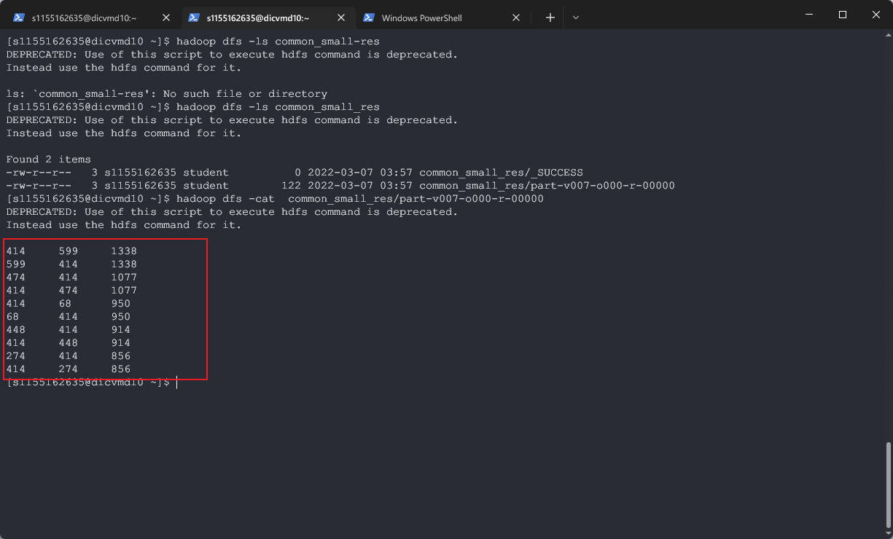

**Large Dataset**

/- Pig Scripts for large dataset: `cmn_movie_count_large.pig` identical to `cmn_movie_count_small.pig`, except for the data loading part

```sql
/************************************************************************	
    HW2 Q3(a): CALCULATING COMMON MOVIES WATCHED BY PAIRS OF USERS
*************************************************************************/

-- LOAD THE DATA: 2 Copies
data1 = LOAD './movielens_large' USING PigStorage(',') AS (userid1:int,movieid1:int);
data2 = LOAD './movielens_large' USING PigStorage(',') AS (userid2:int,movieid2:int);

-- SELF INNER JOIN ON `MOVIES`: to compute each pair of fans of any movie 
cmn_movies = JOIN data1 by movieid1, data2 BY movieid2;
cmn_movies_notself = FILTER cmn_movies BY userid1!=userid2;

-- GROUP THE DATA: (user1,user2,{bag of common movies watched})
cmn_movies_groups = GROUP cmn_movies_notself BY (userid1,userid2);
res = FOREACH cmn_movies_groups GENERATE FLATTEN(group),COUNT(cmn_movies_notself.movieid1) AS common_cnt;

-- OUTPUT: order then select the top 10 pair of users who watch the most shared movies;
res = ORDER res BY common_cnt DESC;
res = LIMIT res 10;
STORE res INTO './common_large_res' USING PigStorage ('/t');
```

/- Execution and result

```shell
$ pig -x mapreduce cmn_movie_count_large.pig
...
$ hadoop dfs -cat common_large_res/part-v007-o000-r-00000
```

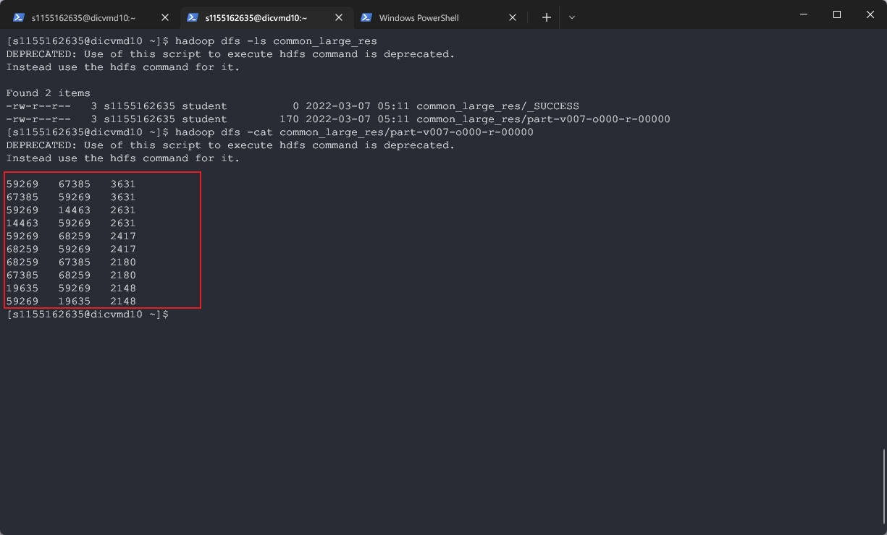

### **(b) [25 Marks]** Find Top-3 most similar users with Pig

**Prerequisites**

My Student ID <u>1155162635</u> ends with **<u>35</u>** and **<u>2635</u>**

**Small Dataset**

/- Write pig scripts for small dataset: `top3_similar_users_small.pig`

```sql
/************************************************************************	
    HW2 Q3(b): SELECTING THE TOP3 MOST SIMILAR USERS OF EACH USER
    SID: 1155162635
*************************************************************************/


/*** 
    STEP#1: Calculate the common movies shared by each pair of the users like Q3(b)
    OUTPUT: (user1,user2,common_cnt)
***/
-- #1.1: LOAD THE DATA: 2 Copies
data1 = LOAD './movielens_small' USING PigStorage(',') AS (userid1:int,movieid1:int);
data2 = LOAD './movielens_small' USING PigStorage(',') AS (userid2:int,movieid2:int);

-- #1.2: SELF INNER JOIN ON `MOVIES`: to compute each pair of fans of any movie 
cmn_movies = JOIN data1 by movieid1, data2 BY movieid2;
cmn_movies_notself = FILTER cmn_movies BY userid1!=userid2;

-- #1.3: GROUP THE DATA: (user1,user2,{bag of common movies watched})
cmn_movies_groups = GROUP cmn_movies_notself BY (userid1,userid2);
cmn_cnt_res = FOREACH cmn_movies_groups GENERATE FLATTEN(group) ,COUNT(cmn_movies_notself.movieid1) AS common_cnt;


/*** 
    STEP#2: Calculate the similarities score of the above user pairs
    OUTPUT: (user1,user2,sim) 
***/
-- #2.1: Calculate the movies sum of each user
user_groups = GROUP data1 BY userid1;
users = FOREACH user_groups GENERATE group AS userid,COUNT(data1.movieid1) AS user_cnt;

-- #2.2: Look for the movies sum of user1&user2 by performing 2 times of LEFT OUTER JOIN
with_user1_cnt = JOIN cmn_cnt_res by userid1 LEFT OUTER, users BY userid;
with_user2_cnt = JOIN with_user1_cnt by userid2 LEFT OUTER, users BY userid;

-- #2.3: Calculate the similarities with inclusion-exclusion priciple
sim_res = FOREACH with_user2_cnt {
			all_cnt = with_user1_cnt::users::user_cnt + users::user_cnt - common_cnt;
			similarities = (float)common_cnt/all_cnt;
			GENERATE userid1, userid2, similarities AS sim;
}


/***
    STEP#3: Rank the similarity score out select the top#3 most similar users of each user
    OUTPUT: (user1,sim_user#1,sim_user#2,sim_user#3)    
***/
-- #3.1: Group by userid1, then rank userid2 by their similarity score
sim_res_groups = GROUP sim_res BY userid1;
res =   FOREACH sim_res_groups {
		user_rank = ORDER sim_res BY sim DESC;
		top3 = LIMIT user_rank 3;
		top3_userid = FOREACH top3 GENERATE userid2;
        GENERATE FLATTEN(group) AS userid,top3_userid;
}

-- #3.2: Join the res with full user list, in case that some users don't share any movie with anyone (unique uid and mid)
-- 		 in that case, the similarity value will be NULL
user_list = FOREACH data1 GENERATE userid1;
user_bag = DISTINCT user_list;
res = JOIN user_bag BY userid1 LEFT OUTER, res BY userid;

-- #3.3: Convert userid into STRING, selecting the results ends with '35'
my_res = FOREACH res GENERATE (chararray)userid1, top3_userid;
my_res = FILTER my_res BY ENDSWITH(userid,'35');
STORE my_res INTO './top3_sim_small' USING PigStorage('/t');
```

/- Execute & Results

```shell
$ pig -x mapreduce top3_similar_users_small.pig
...
$ hadoop dfs -cat top3_sim_small/part-v007-o000-r-00000
```

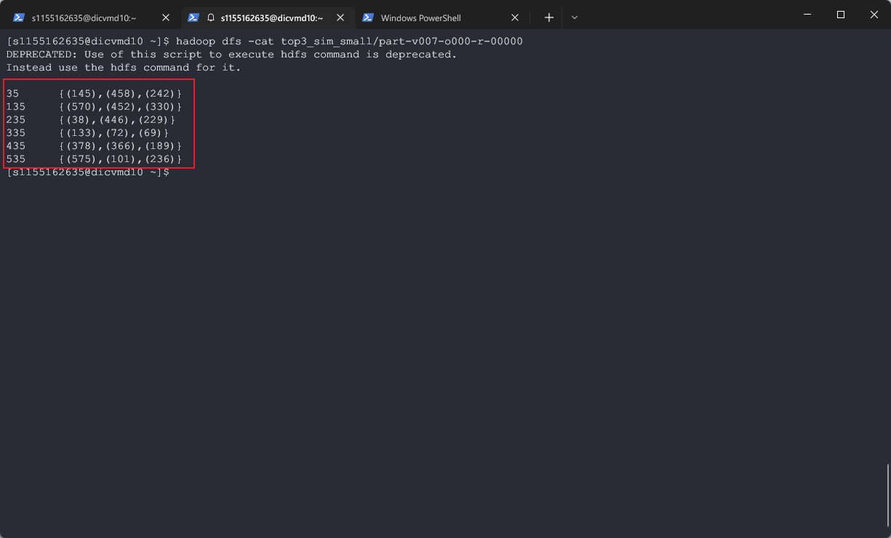

**Large Dataset**

/- Similar Pig Scripts:  `top3_similar_users_large.pig`

```sql
/************************************************************************	
    HW2 Q3(b): SELECTING THE TOP3 MOST SIMILAR USERS OF EACH USER
    SID: 1155162635
*************************************************************************/


/*** 
    STEP#1: Calculate the common movies shared by each pair of the users like Q3(b)
    OUTPUT: (user1,user2,common_cnt)
***/
-- #1.1: LOAD THE DATA: 2 Copies
data1 = LOAD './movielens_large' USING PigStorage(',') AS (userid1:int,movieid1:int);
data2 = LOAD './movielens_large' USING PigStorage(',') AS (userid2:int,movieid2:int);

-- #1.2: SELF INNER JOIN ON `MOVIES`: to compute each pair of fans of any movie 
cmn_movies = JOIN data1 by movieid1, data2 BY movieid2;
cmn_movies_notself = FILTER cmn_movies BY userid1!=userid2;

-- #1.3: GROUP THE DATA: (user1,user2,{bag of common movies watched})
cmn_movies_groups = GROUP cmn_movies_notself BY (userid1,userid2);
cmn_cnt_res = FOREACH cmn_movies_groups GENERATE FLATTEN(group) ,COUNT(cmn_movies_notself.movieid1) AS common_cnt;


/*** 
    STEP#2: Calculate the similarities score of the above user pairs
    OUTPUT: (user1,user2,sim) 
***/
-- #2.1: Calculate the movies sum of each user
user_groups = GROUP data1 BY userid1;
users = FOREACH user_groups GENERATE group AS userid,COUNT(data1.movieid1) AS user_cnt;

-- #2.2: Look for the movies sum of user1&user2 by performing 2 times of LEFT OUTER JOIN
with_user1_cnt = JOIN cmn_cnt_res by userid1 LEFT OUTER, users BY userid;
with_user2_cnt = JOIN with_user1_cnt by userid2 LEFT OUTER, users BY userid;

-- #2.3: Calculate the similarities with inclusion-exclusion priciple
sim_res = FOREACH with_user2_cnt {
			all_cnt = with_user1_cnt::users::user_cnt + users::user_cnt - common_cnt;
			similarities = (float)common_cnt/all_cnt;
			GENERATE userid1, userid2, similarities AS sim;
}


/***
    STEP#3: Rank the similarity score out select the top#3 most similar users of each user
    OUTPUT: (user1,sim_user#1,sim_user#2,sim_user#3)    
***/
-- #3.1: Group by userid1, then rank userid2 by their similarity score
sim_res_groups = GROUP sim_res BY userid1;
res =   FOREACH sim_res_groups {
		user_rank = ORDER sim_res BY sim DESC;
		top3 = LIMIT user_rank 3;
		top3_userid = FOREACH top3 GENERATE userid2;
        GENERATE FLATTEN(group) AS userid,top3_userid;
}

-- #3.2: Join the res with full user list, in case that some users don't share any movie with anyone (unique uid and mid)
-- 		 in that case, the similarity value will be NULL
user_list = FOREACH data1 GENERATE userid1;
user_bag = DISTINCT user_list;
res = JOIN user_bag BY userid1 LEFT OUTER, res BY userid;

-- #3.3: Convert userid into STRING, selecting the results ends with '2635'
my_res = FOREACH res GENERATE (chararray)userid1, top3_userid;
my_res = FILTER my_res BY ENDSWITH(userid,'2635');
STORE my_res INTO './top3_sim_small' USING PigStorage('/t');
```

/- Execute & Results:

```shell
$ pig -x mapreduce top3_similar_users_large.pig
...
$ hadoop dfs -ls top3_sim_large 
$ hadoop dfs -copyToLocal top3_sim_large top3_sim_large2
$ cat top3_sim_large/* >top3_sim_large_agg
$ cat top3_sim_large_agg
```

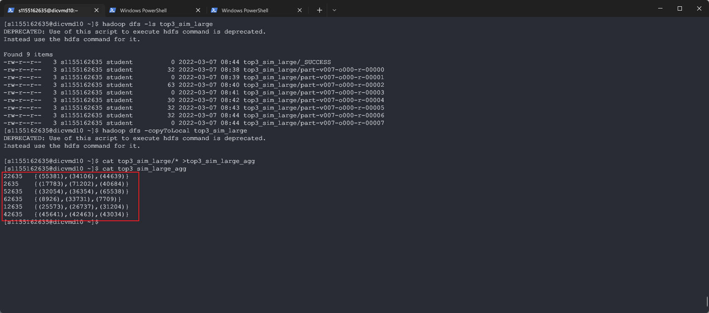

### **(c) [20 Bonus]** Find Top-3 most similar users with Hive

**Small dataset**

/- HiveQL Query Scripts: `top3_similar_user_small.hql`

```sql
/************************************************************************	
    HW2 Q3(c): SELECTING THE TOP3 MOST SIMILAR USERS OF EACH USER
    SID: 1155162635
*************************************************************************/


-- Prerequisite: Create if not exists, truncate the table and refill for debugging & reloading
CREATE TABLE if not exists movielens_small(
    user_id INT,
    movie_id INT)
COMMENT 'hw2_movielens_small'
ROW FORMAT DELIMITED
FIELDS TERMINATED BY ','
LINES TERMINATED BY '/n'
STORED AS TEXTFILE;
TRUNCATE TABLE movielens_small;
LOAD DATA INPATH './movielens_small' OVERWRITE INTO TABLE movielens_small;

-- Same logic as PIG Latin:
-- #1: Create (user1,user2,common_cnt) with INNER JOIN
-- #2: Create (user1,user2,common_cnt,user1_cnt,user2_cnt) with LEFT JOIN
-- #3: Calculate similarity as common_cnt/(user1_cnt + user2_cnt - common_cnt), and rank the instance by similarity with WINDOW FUNCTIONS
WITH sim_rank_table AS(
    SELECT
        uid1,uid2,
        -- cmn_cnt, 
        -- user1_cnt+user2_cnt-cmn_cnt AS all_cnt, 
        -- cmn_cnt/ (user1_cnt+user2_cnt-cmn_cnt) AS sim,
        ROW_NUMBER() over (PARTITION BY uid1 ORDER BY cmn_cnt/ (user1_cnt+user2_cnt-cmn_cnt)  DESC) as sim_rank
    FROM(
        SELECT
            uid1,uid2,COUNT(mid) AS cmn_cnt
        FROM(
            SELECT
            t1.movie_id AS mid, t1.user_id as uid1, t2.user_id AS uid2
            FROM movielens_small t1
            JOIN movielens_small t2 ON t1.movie_id = t2.movie_id AND t1.user_id!=t2.user_id
        ) inner_table
        GROUP BY uid1,uid2
    ) cmn_movie_table
    LEFT JOIN
        (SELECT user_id, COUNT(movie_id) AS user1_cnt FROM movielens_small GROUP BY user_id) t3 ON t3.user_id = cmn_movie_table.uid1
    LEFT JOIN
        (SELECT user_id, COUNT(movie_id) AS user2_cnt FROM movielens_small GROUP BY user_id) t4 ON t4.user_id = cmn_movie_table.uid2
)

-- #4: Select the top#3 results, and concat them with HIVE UDFS COLLECT_LIST(), and left join them with all the users
--     just in case that the user didn't share any movie with others 
SELECT t5.user_id,sim_users_list 
FROM 
    (SELECT uid1,COLLECT_LIST(uid2) AS sim_users_list,COLLECT_LIST(sim_rank) AS sim_rank_list
    FROM sim_rank_table WHERE sim_rank<=3
    GROUP BY uid1) res 
    RIGHT JOIN (SELECT DISTINCT user_id FROM movielens_small) t5 ON t5.user_id = res.uid1 
WHERE CAST(t5.user_id AS STRING) LIKE CONCAT("%","35"); 
```

/- Execution & results

```shell
$ hive -f top3_similar_users_small.hql > hive_res_small
$ cat hive_res_small
```

 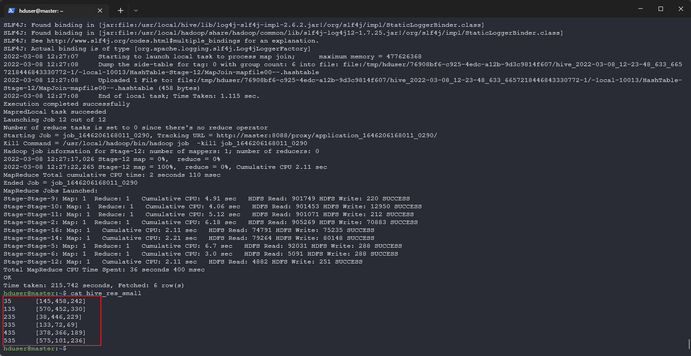

**Large Dataset**

/- HiveQL Query Scripts: `top3_similar_user_large.hql`: identical except for the table name and data loading 

```sql
/************************************************************************	
    HW2 Q3(c): SELECTING THE TOP3 MOST SIMILAR USERS OF EACH USER
    SID: 1155162635
*************************************************************************/


-- Prerequisite: Create if not exists, truncate the table and refill for debugging & reloading
CREATE TABLE if not exists movielens_large(
    user_id INT,
    movie_id INT)
COMMENT 'hw2_movielens_large'
ROW FORMAT DELIMITED
FIELDS TERMINATED BY ','
LINES TERMINATED BY '/n'
STORED AS TEXTFILE;
TRUNCATE TABLE movielens_large;
LOAD DATA INPATH './movielens_large' OVERWRITE INTO TABLE movielens_large;

-- Same logic as PIG Latin:
-- #1: Create (user1,user2,common_cnt) with INNER JOIN
-- #2: Create (user1,user2,common_cnt,user1_cnt,user2_cnt) with LEFT JOIN
-- #3: Calculate similarity as common_cnt/(user1_cnt + user2_cnt - common_cnt), and rank the instance by similarity with WINDOW FUNCTIONS
WITH sim_rank_table AS(
    SELECT
        uid1,uid2,
        -- cmn_cnt, 
        -- user1_cnt+user2_cnt-cmn_cnt AS all_cnt, 
        -- cmn_cnt/ (user1_cnt+user2_cnt-cmn_cnt) AS sim,
        ROW_NUMBER() over (PARTITION BY uid1 ORDER BY cmn_cnt/ (user1_cnt+user2_cnt-cmn_cnt)  DESC) as sim_rank
    FROM(
        SELECT
            uid1,uid2,COUNT(mid) AS cmn_cnt
        FROM(
            SELECT
            t1.movie_id AS mid, t1.user_id as uid1, t2.user_id AS uid2
            FROM movielens_large t1
            JOIN movielens_large t2 ON t1.movie_id = t2.movie_id AND t1.user_id!=t2.user_id
        ) inner_table
        GROUP BY uid1,uid2
    ) cmn_movie_table
    LEFT JOIN
        (SELECT user_id, COUNT(movie_id) AS user1_cnt FROM movielens_large GROUP BY user_id) t3 ON t3.user_id = cmn_movie_table.uid1
    LEFT JOIN
        (SELECT user_id, COUNT(movie_id) AS user2_cnt FROM movielens_large GROUP BY user_id) t4 ON t4.user_id = cmn_movie_table.uid2
)

-- #4: Select the top#3 results, and concat them with HIVE UDFS COLLECT_LIST(), and left join them with all the users
--     just in case that the user didn't share any movie with others 
SELECT t5.user_id,sim_users_list 
FROM 
    (SELECT uid1,COLLECT_LIST(uid2) AS sim_users_list,COLLECT_LIST(sim_rank) AS sim_rank_list
    FROM sim_rank_table WHERE sim_rank<=3
    GROUP BY uid1) res 
    RIGHT JOIN (SELECT DISTINCT user_id FROM movielens_large) t5 ON t5.user_id = res.uid1 
WHERE CAST(t5.user_id AS STRING) LIKE CONCAT("%","2635"); 
```

/- Execution & results

```shell
$ hive -f top3_similar_users_large.hql > hive_res_large
$ cat hive_res_large
```

 

### **/*Notice for Q3(b)(c)**

Some of the results of <u>large dataset</u> produced by PIG didn't match with HIVE, that's because there're several ties in the rank list of similarity and the sorting mechanisms interpreted by HIVE and PIG are different, which you could refer to screenshots below, listing both results along with the top15 similar users for each user.

For example, for user 12635, PIG's top3 is [22573, 26737,<u>31204</u>], and HIVE's top3 is [25573,26737,<u>9153</u>], where 9153 and 31204 are both rank 2nd in the for user 12635 in terms of similarity. 

| PIG result                                                   | HIVE result                                                  |
| ------------------------------------------------------------ | ------------------------------------------------------------ |
| 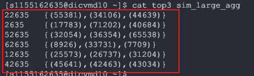 | 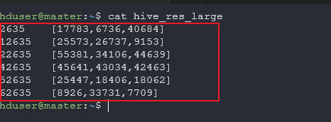 |

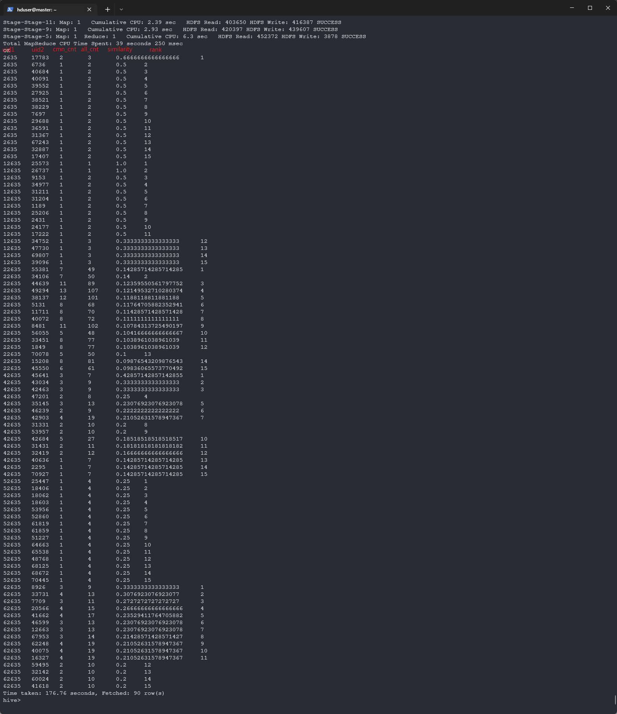


Also, I detected user 32635 is missing in both PIG and HIVE results, and this is because the user doesn't exist in the large dataset.

```sql
hive> SELECT * FROM movielens_large WHERE user_id=32635;
```

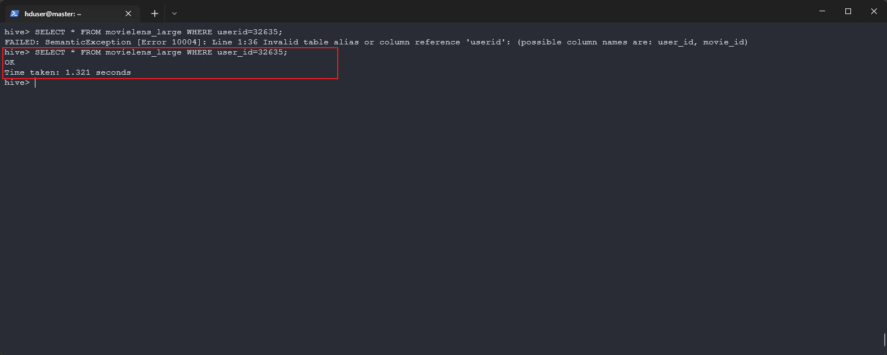


## **Reference**

[^1]:Official Document for Apache Pig: http://pig.apache.org/docs/r0.17.0/start.html#Pig+Setup
[^2]:Tutorial of Apache Pig: https://www.tutorialspoint.com/apache_pig/index.htm
[^3]:Official Document for Apache HIve: https://cwiki.apache.org/confluence/display/Hive/GettingStarted#GettingStarted-InstallationandConfiguration

[^4]:Configure hive-site.xml: https://zhuanlan.zhihu.com/p/326901148
[^5]:Hive QL References & Tutorial: https://www.tutorialspoint.com/hive/index.htm

[^6]:MySQL Connector Java Package Download: https://downloads.mysql.com/archives/c-j/


