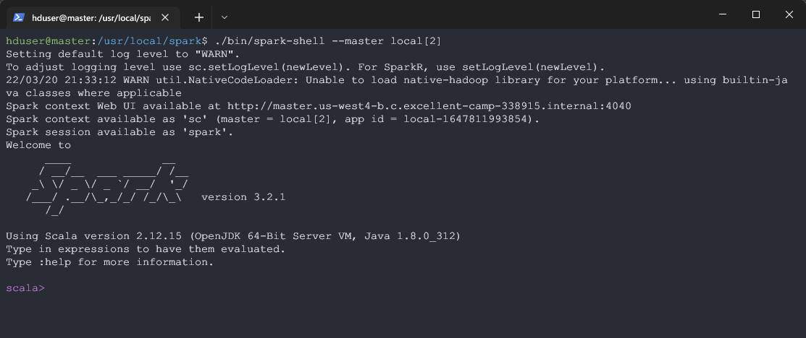

<h1 align=center>IEMS5730 Homework#3</h1>

<p align=center>1155162635 LIU Zijian</p>

<h2 align=center>Declaration</h2>


[TOC]


## **Q1[10 Marks + 10 Bonus]** Setup Spark Cluster

### **a) [10 Marks]** Setup Spark 3.2.1 standalone

With pre-installed Hadoop, download the Hadoop-Free Version, unzip into `/usr/local/spark` 

```shell
$ wget https://dlcdn.apache.org/spark/spark-3.2.1/spark-3.2.1-bin-without-hadoop.tgz
$ tar -xvzf spark-3.2.1-bin-without-hadoop.tgz
$ sudo mv spark-3.2.1-bin-without-hadoop /usr/local/spark
```

Configure  `./conf/spark-env.sh`

```shell
export SPARK_DIST_CLASSPATH=$(hadoop classpath)
```

Open the shell 

```shell
$ /usr/local/spark/bin/spark-shell --master local[2]
```




### **b) [10 Bonus]** Setup multi-node Spark Cluster[^1]

Add the above  to system `PATH`, in `./.bashrc` file

```shell
export PATH=/usr/local/spark/bin:$PATH
export SPARK_HOME=/usr/local/spark
export LD_LIBRARY_PATH=/usr/local/hadoop/lib/native:$LD_LIBRARY_PATH
```

Edit Spark default template config file: `./conf/spark-defaults.conf`

```shell
spark.master			          yarn
spark.driver.memory				  512m
spark.yarn.am.memory    		  512m
spark.executor.memory          	  512m
spark.eventLog.enabled			  true
spark.eventLog.dir 				  hdfs://master:54310/spark-logs
spark.history.provider            org.apache.spark.deploy.history.FsHistoryProvider
spark.history.fs.logDirectory     hdfs://master:54310/spark-logs
spark.history.fs.update.interval  10s
spark.history.ui.port             18080
```

Create relevant directory in Hadoop

```shell
$ hadoop dfs -mkdir /spark-logs
```

Re-allocate the `vmem/pmem ratio` in `yarn.site.xml`, in namenode and 3 datanodes[^2]

```xml
<property>
    <name>yarn.nodemanager.vmem-pmem-ratio</name>
    <value>4</value>
</property>
```

Entering `spark-shell`


## **Q2 [35 marks]** Spark Basic RDD

### **a) [15 Marks]** Naive implementation of PageRank 

`hw3_q2_a.py`

```python
from pyspark import SparkContext, SparkConf

def rank_count(x):
    res = [] 
    size = len(x[1][0])
    for link in x[1][0]:
        res.append((link,x[1][1]/size))
    return res

if __name__=="__main__":
    conf = SparkConf().setAppName("hw3_q2_a")
    sc = SparkContext(conf=conf)
    # Generate neighbor list for all nodes: (fromNode,(neighbors))
    lines = sc.textFile("hdfs://master:54310/user/hduser/web-Google.txt")
          	  .filter(lambda x: "#" not in x)
          	  .map(lambda x:x.split("\t"))
    links = lines.groupByKey().mapValues(tuple)
    
    # Generate initial ranks for all distinct nodes: (node,1)
	ranks = links.mapValues(lambda x:1)
    
    # PageRank calcualation for 10 iterations
    for i in range(10):
        contribs = links.join(ranks).flatMap(rank_count)
        ranks = contribs.reduceByKey(lambda x,y:x+y).mapValues(lambda x:0.15+0.85*x)
    
    # Sort & Save
    #print(ranks.sortBy(lambda x:x[1],ascending=False).take(100))
    ranks.sortBy(lambda x:x[1],ascending=False).saveAsTextFile("hw3_q2_a_res")
```

Submit over `spark-submit`

```shell
$ spark-submit \
    --deploy-mode cluster \
    --master yarn \
    hw3_q2_a.py
```

Top 100 Nodes


### **b) [20 Marks]** Advanced implementation of PageRank

The default num of partitions after executing `sc.textFile` is 2, shown as the following screenshot. Here's the explanation from Spark Official Doc[^8]:

> The `textFile` method also takes an optional second argument for controlling the number of partitions of the file. By default, Spark creates one partition for each block of the file (blocks being 128MB by default in HDFS), but you can also ask for a higher number of partitions by passing a larger value. Note that you cannot have fewer partitions than blocks.

The optimal partitions values, theorectically, should be related to the number of cluster cpu cores. In my case (4  `n1-standard-2` gcp instance, each with a vcpu of 2 cores), the partition number should be 8, or 2\*8=16, or 3\*8=24. etc.


`hw3_q2_b_x.py`:  experimenting 3 different parameters: 8 / 10 / 16, take `hw3_q2_b_8.py` for code showcasing

```python
from pyspark import SparkContext, SparkConf

def rank_count(x):
    res = [] 
    size = len(x[1][0])
    for link in x[1][0]:
        res.append((link,x[1][1]/size))
    return res

if __name__=="__main__":
    num_partitions = 8 #num_partitions = 8/10/16
    conf = SparkConf().setAppName("hw3_q2_b_{}".format(num_partitions))
    sc = SparkContext(conf=conf)
    lines = sc.textFile("hdfs://master:54310/user/hduser/web-Google.txt")
              .filter(lambda x: "#" not in x)
              .map(lambda x:x.split("\t"))
            
    links = lines.groupByKey().mapValues(tuple).partitionBy(8).persist()
    ranks = links.mapValues(lambda x:1)
    # PageRank calcualation for 10 iterations
    for i in range(10):
        contribs = links.join(ranks).flatMap(rank_count)
        ranks = contribs.reduceByKey(lambda x,y:x+y).mapValues(lambda x:0.15+0.85*x)
    # Sort & Save
    ranks.sortBy(lambda x:x[1],ascending=False).saveAsTextFile("hw3_q2_b_{}".format(num_partitions))
```

Performance Comparison & Observations


As shown from the above result, <u>8 partitions (2.2 min)</u> claims the highest performance. There're 8 cpu cores, meaning that at most 8 parallel jobs could be executed at a time. And 8 partitions fully utilized the parallel resources within 1 round.

<u>10 partitions (2.5 min)</u>  slows down a bit , since there're 10-8=2 idle tasks compared to execution with 8 partitions. 

<u>16 partitions (2.7min)</u> claims the slowest, since the partitioned data is too small for one task and the overhead within each task becomes huge relatively. 

And noteworthy, the final step of implementation code involves `sortBy()`, which causes another round of shuffling. Therefore, there's also a trade-off between more partitions(less computational time within) and less partition(more shuffling overhead/complexity within).


## **Q3[35 Marks]** Spark SQL

Copy the crime data into HDFS, and enter the pyspark shell via `pyspark` (master default configured as yarn in Q1(b)):


### **a) [10 Marks]** Preprocessing

```python
crime = spark.read.csv("Crime_Incidents_in_2013.csv",header=True)
crime.createOrReplaceTempView("crime")
crime_a = spark.sql("SELECT CCN,REPORT_DAT,OFFENSE,METHOD,END_DATE,DISTRICT FROM crime").na.drop()
crime_a.show()
crime_a.count()
```


### **b) [10 Marks]** Count the no. of each type offenses & find most crimes occurring time-slot/shift

```python
# Count the number of each type offenses
crime.groupby("OFFENSE").count().show()
# Find which shift did most crimes occur
crime.groupby("SHIFT").count().show()
```

Most crimes happen in EVENING shift according to the result


### **c) [15 Marks] ** Merge 9 Tables into one and compute the percentage of gun offense yearly

Download the 9  `crime_incidents_in_201x.csv` files into `crimes/` folder and upload it to HDFS, and enter the `pyspark` shell:


Type the following command:

```python
from pyspark.sql import functions as F
from pyspark.sql.window import Window
crimes = spark.read.csv("hdfs://master:54310/user/hduser/crimes/",header=True)
crimes.createOrReplaceTempView("crimes")
crimes_year_method = spark.sql("SELECT YEAR(TO_DATE(SUBSTRING_INDEX(REPORT_DAT,' ',1),'yyyy/MM/dd')) AS YEAR, METHOD FROM crimes")
res = crimes_year_method.groupby(['METHOD','YEAR']).count() \
                      	.withColumn("year_sum",F.sum("count").over(Window.partitionBy("year"))) \
                      	.withColumn("year_percent",F.col('count')/F.col("year_sum")) \
                      	.filter("METHOD=='GUN'")
res.show()
res.repartition(1).write.csv("./hw3_q3_c_res", encoding="utf-8", header=True)
```


Since Obama published his 23 executive actions on gun control in 2013[^10], the percentage of gun assaulting crimes `year_percent` showed an obviously declining trend, fluctuating below 6%. The first year 2014 is the most effective,  not only the percentage dropped by 1% from 6.1% to 5.1% , the absolute figure `year_count` also showed a significant decrease, from 2203 to 1964 reducing by almost 10%. However, the situation rebounded in 2015 and 2016, with `year_count` and `year_percent` both increase to an approxiamte level of 2013 before the executive actions take effects. This could be explained by the fact that these executive actions are published under the context of the failure of the previous reform amendment[^11], which actually contributed little to the overall percentage of gun crimes. 

Another significant event is the release of new executive actions to reduce gun violence in 2016, following a tearful and touching speech by Obama. After that, the percentage of gun crimes drop significantly to below 5% in both 2017 and 2018, and the `year count` also reaches the lowest point in the studied 9 years.


## **Q4[10 Bonus]** Setup and run a Spark application over Kubernetes

### **a) [3 marks]** Build Docker Images of Spark

```shell
$ sudo chmod 666 /var/run/docker.sock 
$ docker-image-tool.sh -r docker.io/s1155162635 -t v3.2.1 build
```


### **b) [3 marks]** Push the Docker Images

```shell
$ docker login
$ docker-image-tool.sh -r s1155162635 -t v3.2.1 push
```


### **c) [4 Marks]** Submit the spark job to IE DIC K8s Cluster

Testing if the `SparkPi` example works under the configured environment 

```shell
$ globalprotect connect --portal sslvpn.ie.cuhk.edu.hk
$ bin/spark-submit \
    --master k8s://https://172.16.5.98:6443 \
    --deploy-mode cluster \
    --name spark-pi \
    --class org.apache.spark.examples.SparkPi \
    --conf spark.app.name=sparkpi \
    --conf spark.kubernetes.authenticate.driver.serviceAccountName=spark \
    --conf spark.kubernetes.namespace=s1155162635 \
    --conf spark.kubernetes.container.image=docker.io/s1155162635/spark:v3.2.1 \
    --conf spark.kubernetes.container.image.pullPolicy=Always \
    local:///opt/spark/examples/jars/spark-examples_2.12-3.2.1.jar \
    1000
```

Succeeded as follows:


Writing the `word_count.scala` example

```scala
import org.apache.spark.{SparkConf,SparkContext}
 
object wordCount{
    def main(args:Array[String]){
        val conf = new SparkConf().setAppName("wordCount")
        val sc = new SparkContext(conf)
        val lines = sc.textFile("file:///opt/spark/data/shakespeare/*")
        val words = lines.flatMap(_.split(" ")).filter(word => word != "")
        val pairs = words.map(word => (word,1))
        val wordscount = pairs.reduceByKey(_ + _ )
        wordscount.collect.foreach(value => {
            println(value)
            
        })
        sc.stop()
    }
}
```

Using `sbt` to compile jar

```
name := "Simple Project"
version := "1.0"
scalaVersion := "2.12.15"
libraryDependencies += "org.apache.spark" %% "spark-core" % "3.2.1"
```

Copy the jar to `~/spark-3.2.1-bin-hadoop3.2/examples/jars`, download and move the shakespeare dataset into `~/spark-3.2.1-bin-hadoop3.2/data`, then re-build and push to docker.io

```shell
$ docker-image-tool.sh -r docker.io/s1155162635 -t v3.2.1 build
$ docker-image-tool.sh -r s1155162635 -t v3.2.1 push
```

submit the job via `spark_submit` over k8s

```shell
$ bin/spark-submit \
    --master k8s://https://172.16.5.98:6443 \
    --class "wordCount" \
    --deploy-mode cluster \
    --conf spark.kubernetes.authenticate.driver.serviceAccountName=spark \
    --conf spark.kubernetes.namespace=s1155162635 \
    --conf spark.kubernetes.container.image=docker.io/s1155162635/spark:v3.2.1 \
    --conf spark.kubernetes.container.image.pullPolicy=Always \
    local:///opt/spark/examples/jars/simple-project_2.12-1.0.jar 
```

See the output result

```shell
$ kubectl logs -f wordcount-f95d237fd091f336-driver -n s1155162635
```


## **Q5[10 Bonus]** Fault Tolerance mechanisms for Spark over k8s

### **a)** Re-run & kill executor pod

Execute same as q4 c

```shell
$ bin/spark-submit \
    --master k8s://https://172.16.5.98:6443 \
    --class "wordCount" \
    --deploy-mode cluster \
    --conf spark.kubernetes.authenticate.driver.serviceAccountName=spark \
    --conf spark.kubernetes.namespace=s1155162635 \
    --conf spark.kubernetes.container.image=docker.io/s1155162635/spark:v3.2.1 \
    --conf spark.kubernetes.container.image.pullPolicy=Always \
    local:///opt/spark/examples/jars/simple-project_2.12-1.0.jar 
```

Get pod ID, kill executor pods and then get pods status again

```shell
$ kubectl get pods -n s1155162635
$ kubectl delete pod wordcount-11544d7fd0a979a3-exec-1 -n s1155162635 #delete one of the executor pods
$ kubectl get pods -n s1155162635
```


Check the driver pod

```shell
$ kubectl logs wordcount-88faf07fd0a95154-driver -n s1155162635| head -n 1000 #check the driver pod
```


The spark driver detected the lost of the executer and the shuffle files, and then request another executor to resubmit the relevant task (`ShuffleMapTask` according to the screenshot) according to the DAG schedules. The Spark job hence continued and completed at last.


### **b)** Re-run & kill driver pod

Resubmit the job, then

```shell
$ kubectl get pods -n s1155162635
$ kubectl delete pod wordcount-6529e07fd0b6b1ac-driver -n s1155162635 #delete the driver pod
$ kubectl get pods -n s1155162635
```

On the job running terminal:


On another terminal:


The above results proves that without the Spark driver, the tasks cannot be rescheduled and the spark job cannot continue to complete.


## **References**

[^1]:Running Spark on top of Yarn: https://www.linode.com/docs/guides/install-configure-run-spark-on-top-of-hadoop-yarn-cluster/
[^2]:Error "container is running beyond virtual memory limits": https://blog.csdn.net/L_15156024189/article/details/106647535?spm=1001.2101.3001.6650.1&utm_medium=distribute.pc_relevant.none-task-blog-2%7Edefault%7ECTRLIST%7ERate-1.pc_relevant_aa&depth_1-utm_source=distribute.pc_relevant.none-task-blog-2%7Edefault%7ECTRLIST%7ERate-1.pc_relevant_aa&utm_relevant_index=2
[^3]: PythonRDD common Func collections: https://blog.csdn.net/u014204541/article/details/81130870
[^4]:Pre-partition in RDD: https://stackoverflow.com/questions/45604297/why-pre-partition-will-benefit-spark-job-because-of-reducing-shuffling
[^5]:SparkRDD's Transformation/action: https://blog.51cto.com/u_12564104/2891893
[^6]:Difference between sortBy().take() / top(): https://www.cnblogs.com/wuzhiblog/p/14416652.html
[^7]:Pyspark Window Functions: https://blog.csdn.net/weixin_45736572/article/details/122813118
[^8]: Determine the number of partitions: https://www.youtube.com/watch?v=WGNcy4yKTRo
[^9]: Default Partitions for `sc.textFile`: https://spark.apache.org/docs/latest/rdd-programming-guide.html#:~:text=By%20default%2C%20Spark%20creates%20one,by%20passing%20a%20larger%20value.
[^10]:obama-gun-control-executive-order: https://www.vox.com/2016/1/4/10708324/obama-gun-control-executive-order 
[^11]: Gun control: Barack Obama condemns 'shameful' failure to pass reform

[^12]: The usage of sbt：https://blog.csdn.net/donger__chen/article/details/99236021


