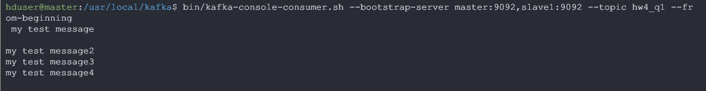

<h1 align=center>IEMS5730 Spring2022 Homework#4 </h1>

<p align=center>1155162635 LIU Zijian</p>

<h2 align=center>Declaration</h2>


[TOC]

## **Q1A [10 Bonus]** Multi-node Kafka Cluster Setup 

Download the latest Kafka on 2 nodes(`master` and `slave1` in my case) respectively and extract them

```shell
$ wget https://dlcdn.apache.org/kafka/3.1.0/kafka_2.13-3.1.0.tgz
$ tar -xzf kafka_2.13-3.1.0.tgz
$ mv kafka_2.13-3.1.0 /usr/local/kafka
$ cd /usr/local/kafka
```

Zookeeper configuration in `~/config/zookeeper.properties ` on both nodes, set/add the following settings

```shell
maxClientCnxns=128
initLimit=10
syncLimit=5
server.1=master:2888:3888
server.2=slave1:2888:3888
```

Kafka broker configuration in `~/config/server.propertities`, set/add the following settings

```shell
broker.id=1 # for broker2 id=2
num.partitions=2
zookeeper.connect=master:2181,slave1:2181
```

Start Zookeeper & Kafka Broker services on both nodes

```shell
$ bin/zookeeper-server-start.sh config/zookeeper.properties
$ bin/kafka-server-start.sh config/server.properties
```

Create a topic named `hw4_q1` on `master` [^2]

```shell
$ bin/kafka-topics.sh 	--create --bootstrap-server master:9092,slave1:9092 /
                        --replication-factor 2 --partitions 2 /
                        --topic hw4_q1
$ bin/kafka-topics.sh --describe --topic hw4_q1 --bootstrap-server master:9092,slave1:9092
```


Write/Read `my test message` event to the topic

```shell
$ bin/kafka-console-producer.sh --broker-list master:9092,slave1:9092 --topic hw4_q1
$ bin/kafka-console-consumer.sh --bootstrap-server master:9092,slave1:9092 --topic hw4_q1 --from-beginning # in another terminal
```

| Operations |              Screenshots               |
| :--------: | :------------------------------------: |
|   write    |  |
|    read    |   |


## **Q1B [15 Bonus]** Setup Kafka Cluster Over Kubernetes

Install Helm on the machine used in HW3 

```shell
$ curl https://baltocdn.com/helm/signing.asc | sudo apt-key add -
$ sudo apt-get install apt-transport-https --yes
$ echo "deb https://baltocdn.com/helm/stable/debian/ all main" | sudo tee /etc/apt/sources.list.d/helm-stable-debian.list
$ sudo apt-get update
$ sudo apt-get install helm
```

Launch a multi-node Kafka cluster over k8s via Helm

```shell
$ globalprotect connect --portal sslvpn.ie.cuhk.edu.hk # Connect to IE VPN first
$ wget https://mobitec.ie.cuhk.edu.hk/ierg4330/static_files/assignments/kafka-value.yml
$ helm repo add incubator https://charts.helm.sh/incubator
$ helm install -f kafka-value.yml -n s1155162635 kafka incubator/kafka
```


Verify the setup

```shell
# Login into the bash command line
$ wget https://mobitec.ie.cuhk.edu.hk/ierg4330/static_files/assignments/kafka-testclient.yml
$ kubectl apply -f kafka-testclient.yml -n s1155162635
$ kubectl exec -it testclient bash -n s1155162635 
# Create a topic and write/read events from it
$ bin/kafka-topics.sh --create --zookeeper kafka-zookeeper:2181 --replication-factor 1 --partitions 1 --topic my-test-topic
$ bin/kafka-console-producer.sh --broker-list kafka-headless:9092 --topic my-test-topic
$ bin/kafka-console-consumer.sh --bootstrap-server kafka:9092 --topic my-test-topic --from-beginning # in another terminal
```

| Operations |              Screenshots               |
| :--------: | :------------------------------------: |
|   write    |  |
|    read    |   |


## **Q2 [50 Marks + 5 Bonus]** Count the Most Frequent Hashtags with Spark RDD Streaming

### Over IE Kafka/Spark Clusters

Create a topic

```shell
$ /usr/hdp/2.6.5.0-292/kafka/bin/kafka-topics.sh --create --zookeeper dicvmd7.ie.cuhk.edu.hk:2181 --replication-factor 2 -partitions 2 --topic 1155162635_hw4
```

Create `tweets_producer.sh` 

```shell
#!/bin/bash
while read line
do
	sleep $(($RANDOM%4+1))
    echo $line | /usr/hdp/2.6.5.0-292/kafka/bin/kafka-console-producer.sh --broker-list dicvmd7.ie.cuhk.edu.hk:6667 --topic 1155162635_hw4
done < new_tweets.txt
```

```shell
# Execute the script, and Read the events to see if successfully write
$ /usr/hdp/2.6.5.0-292/kafka/bin/kafka-console-consumer.sh --zookeeper dicvmd7.ie.cuhk.edu.hk:2181 --topic 1155162635_hw4 --from-beginning
```

	

```shell
# Delete and Restart Topic for reset
$ /usr/hdp/2.6.5.0-292/kafka/bin/kafka-topics.sh --zookeeper dicvmd7.ie.cuhk.edu.hk:2181 --delete --topic 1155162635_hw4
$ /usr/hdp/2.6.5.0-292/kafka/bin/kafka-topics.sh --create --zookeeper dicvmd7.ie.cuhk.edu.hk:2181 --replication-factor 2 -partitions 2 --topic 1155162635_hw4
```

Create `tweets_consumer.py` [^3][^4][^5][^6] , and submit to spark cluster

```python
from pyspark.streaming.kafka import KafkaUtils
from pyspark import SparkConf, SparkContext
from pyspark.streaming import StreamingContext
from pyspark.sql import Row, SQLContext
import sys
import json
import time


def process_rdd(time, rdd):
    print("---------- %s -----------" % str(time))
    try:
 		# Top30: sortBy() and take() 
        sorted_rdd = rdd.sortBy(lambda x:x[1],ascending=False)
        print(sorted_rdd.take(30)) #  Check output at: yarn-webUI/applicationID/log/stdout
    except:
        e = sys.exc_info()
        print("Error: ", e)

if __name__ == '__main__':
    sc = SparkContext(appName="TweetsHashtagCount")
    sc.setLogLevel("WARN")

    ssc = StreamingContext(sc, 10)
    ssc.checkpoint('./checkpoint')
    kafkaStream = KafkaUtils.createStream(ssc, 'dicvmd7.ie.cuhk.edu.hk:2181', 'consumer', {'1155162635_hw4': 2})
    counts = kafkaStream.map(lambda x: x[1])/
                        .map(lambda x: x.split(",2021")[0]) /
                        .flatMap(lambda x: x.split(" ")) /
                        .filter(lambda x: x.startswith("#")) /
                        .map(lambda x: (x,1)) /
                        .reduceByKeyAndWindow(lambda x,y:x+y, lambda x,y: x-y, 300, 120) # WinLength: 5min // Interval: 2min 
    counts.foreachRDD(process_rdd)
    ssc.start()
    ssc.awaitTermination() # Terminate manually by killing the application 
```

Execute the `tweets_producer.sh`[^9] and `tweets_consumer.py` <u>at the same time</u>, in different terminals

```shell
# Producer
$ nohup ./tweets_producer.sh &
# Consumer
$ spark-submit /
    --master yarn /
    --deploy-mode cluster /
    --packages org.apache.spark:spark-streaming-kafka-0-8_2.11:2.3.0 /
    tweets_consumer.py
```


Output sample for 1h (22:30~23:30) : Check the `stdout` at Yarn WebUI/applicationID/logs <u>(**Please Zoom to see the high-resolution screenshot**)</u>

/- Calculate and Output the last 5 minutes top30 hashtags every 2 minutes 


### Over IE k8s Cluster (Fail)

Create a topic `tweets` via IE DIC k8s

```shell
# Connect to IE VPN first
$ globalprotect connect --portal sslvpn.ie.cuhk.edu.hk 
# Login to the bash
$ kubectl exec -it testclient bash -n s1155162635
# Create a topic
$ bin/kafka-topics.sh --create --zookeeper kafka-zookeeper:2181 --replication-factor 2 --partitions 2 --topic tweets
# Delete topics for debugging use
$ bin/kafka-topics.sh --delete --zookeeper kafka-zookeeper:2181 --topic tweets
```

Producer: `tweets_producer.sh`

```sh
#!/bin/bash
while read line
do
	sleep 1
    echo $line | bin/kafka-console-producer.sh --broker-list kafka-headless:9092 --topic tweets
done < new_tweets.txt
```

Upload the code and dataset to the pod

```shell
$ kubectl cp tweets_producer.sh s1155162635/testclient:/opt/kafka
$ kubectl cp new_tweets.txt s1155162635/testclient:/opt/kafka
# Open the pod shell, and run the producer.sh script 
$ kubectl exec -it testclient bash -n s1155162635
$ chmod +x tweets_producer.sh
$ ./tweets_producer.sh
# Can use kubectl exec directlt from local machine
$ kubectl exec -it testclient bash -n s1155162635 -- ./producer.sh 
# in another terminal
$ kubectl exec -it testclient bash -n s1155162635 -- ./bin/kafka-console-consumer.sh --bootstrap-server kafka-headless:9092 --topic tweets --from-beginning 
```

Check the topic `tweets` producing/consuming status via console:

|   Operations    |              Screenshots               |
| :-------------: | :------------------------------------: |
| write(producer) |  |
| read(consumer)  |   |

Consumer: `tweets_consumer.scala` , built with `sbt`and save to  `~/examples/examples/jars/simple-project_2.12-1.0.jar`, spark version: 3.2.1

```scala
import org.apache.spark._
import org.apache.spark.streaming._
import org.apache.spark.streaming.StreamingContext._ // not necessary since Spark 1.3
import org.apache.spark.rdd.RDD
import org.apache.kafka.clients.consumer.ConsumerRecord
import org.apache.kafka.common.serialization.StringDeserializer
import org.apache.spark.streaming.kafka010._
import org.apache.spark.streaming.kafka010.LocationStrategies.PreferConsistent
import org.apache.spark.streaming.kafka010.ConsumerStrategies.Subscribe


object WordCountTest {

  def main(args: Array[String]) {

    val checkpointDir = "./checkpoint"
    val topic = "tweets"
    val conf = new SparkConf()
      .setAppName("tweetsHashTagCounts")
      .setJars(SparkContext.jarOfClass(this.getClass).toSeq)
     
    val ssc = new StreamingContext(conf, Seconds(10))
    ssc.checkpoint(checkpointDir)
    
    val topics = Set(topic)
    val kafkaParams = Map[String, Object](
                "bootstrap.servers" -> "kafka-headless:9092",
                "key.deserializer" -> classOf[StringDeserializer],
                "value.deserializer" -> classOf[StringDeserializer],
                "group.id" -> "tweets",
                "auto.offset.reset" -> "latest",
                "enable.auto.commit" -> (false: java.lang.Boolean)
                )
    val kafkaStream = KafkaUtils.createDirectStream[String, String](
                    ssc,
                    PreferConsistent,
                    Subscribe[String, String](topics, kafkaParams)
                    )
    val counts = kafkaStream.map(_._1)/
                      .map(record=>record.split(",2021")._1) /
                      .flatMap(_.split(" ")) /
                      .filter(_.startswith("#")) /
                      .map((_,1)) /
                      .reduceByKeyAndWindow(_+_,_-_ ,Seconds(30),Seconds(10))

    stream.foreachRDD(rdd => {
      //val offsetRange = rdd.asInstanceOf[HasOffsetRanges].offsetRanges
      sorted_rdd = rdd.sortBy(_._2,false)
      println(sorted_rdd.take(30))
    })
    ssc.start()
    ssc.awaitTermination()
  }
}
```

Submit the streaming job to IE DIC k8s cluster, with multiple dependencies:

```shell
$ bin/docker-image-tool.sh -r docker.io/s1155162635 -t v3.2.1 build
$ bin/docker-image-tool.sh -r s1155162635 -t v3.2.1 push
$ bin/spark-submit /
        --master k8s://https://172.16.5.98:6443 /
        --jars local:///opt/spark/examples/jars/kafka-clients-2.8.0.jar,local:///opt/spark/examples/jars/spark-streaming-kafka-0-10_2.12-3.2.1.jar,local:///opt/spark/examples/jars/spark-token-provider-kafka-0-10_2.12-3.2.1.jar /
        --class "StationJourneyCountDirectApp" /
        --deploy-mode cluster /
        --conf spark.kubernetes.authenticate.driver.serviceAccountName=spark /
        --conf spark.kubernetes.namespace=s1155162635 /
        --conf spark.kubernetes.container.image=docker.io/s1155162635/spark:v3.2.1 /
        --conf spark.kubernetes.container.image.pullPolicy=Always /
        local:///opt/spark/examples/jars/simple-project_2.12-1.0.jar
```

Container keeps running, but there's no input from kafka. Throwing error of `Kafka010ConfigFailure`, unable to connect with kafka pods


## **Q3 [40 Marks]** Spark Structured Streaming on Kafka

### Over IE DIC Kafka/Spark Cluster

Create a topic 

```shell
$ /usr/hdp/2.6.5.0-292/kafka/bin/kafka-topics.sh --create --zookeeper dicvmd7.ie.cuhk.edu.hk:2181 --replication-factor 2 -partitions 2 --topic 1155162635_hw4_2
```

`tweets_producer_2.sh`

```sh
#!/bin/bash
while read line
do
	sleep $(($RANDOM%4+1))
    echo $line | /usr/hdp/2.6.5.0-292/kafka/bin/kafka-console-producer.sh --broker-list dicvmd7.ie.cuhk.edu.hk:6667 --topic 1155162635_hw4_2
done < new_tweets.txt
```

Enter the `pyspark` shell

```shell
$ pyspark --packages org.apache.spark:spark-sql-kafka-0-10_2.11:2.3.0
```

Type the following python scipts into the shell, meanwhile starting the producer above[^10]

```python
from pyspark.sql import SparkSession
from pyspark.sql.functions import *
from pyspark.sql import functions as F
from pyspark.sql.window import Window

spark = SparkSession /
    .builder /
    .appName("tweets_consumer_structured") /
    .getOrCreate()

df = spark.readStream /
    .format("kafka") /
    .option("kafka.bootstrap.servers", "dicvmd7.ie.cuhk.edu.hk:6667") /
    .option("subscribe", "1155162635_hw4_2") /
    .load()

lines = df.selectExpr("CAST(timestamp AS TIMESTAMP)","CAST(value AS STRING)")
words = lines.withColumn("contents",split('value', ",2021")) /
				.select(col("contents")[0].alias("contents"),'timestamp')/
				.withColumn("words",explode(split('contents',' ')))
hashtags = words.filter(words.words.startswith("#"))
hashtags_cnt = hashtags.withWatermark('timestamp','5 minutes')/
					   .groupBy(
                       		window('timestamp',"5 minutes", "2 minutes"),
                       		hashtags.words)/
    				   .count().orderBy([asc('window'),desc('count')])
'''
	Error: 
	Non time-based window func is not supported on Streaming DataFrames/Dataset  
    # hashtags_rank = hashtags_cnt.withColumn("rank",row_number().over(Window.partitionBy('window').orderBy(desc("count"))))
    # hashtags_top = hashtags_rank.filter(hashtags_rank.rank<=5)
    # query = hashtags_cnt.writeStream /
    #         .format("console") /
    #        .outputMode("complete")/
    #        .option("truncate",False)/
    #        .trigger(processingTime='10 seconds')/
    #        .start()

'''

# Starts streaming and save the results into memory 
query = hashtags_cnt.writeStream /
        			.queryName("hashtag_cnts") /
    				.outputMode("complete") /
        			.format("memory") /
            		.trigger(processingTime='5 minutes')/
        			.start()           
```


Sample Results for 34 minutes(22:18-22:51) streaming: (**Please Zoom to see the high-resolution screenshot**)

```shell
# In the same consumer terminal, read the complete table from memory and rank the counts of each time window
hashtags_rank = spark.sql("SELECT * FROM hashtag_cnts") /
			  .withColumn("rank",row_number().over(Window.partitionBy('window').orderBy(desc("count"))))
    
hashtags_top = hashtags_rank.filter(hashtags_rank.rank<=30) /
							.withColumn("res",concat_ws(':',col('words'),col('count')))/
                            .groupBy('window').agg(collect_list('res'))
hashtags_top.show(50,truncate=False)
```


**/*Notice:**

Problems Encountered: Cannot directly output the Top30 Hashtags before `writestream`

/- Sorting in `append`/`update` mode is not supported, only `complete  ` is supported. Therefore, the console/memory can't output/store the latest batch dataframes of the time window. It's only allowed to output the entire table from the streams begins. 


/- Non time-based window func is not supported on Streaming DataFrames/Dataset, and under the context of `complete` output mode, it seems <u>not possible</u> to output the Top N hashtags within each window group in writestream


Solutions and results:

As shown in the above codes, store the hashtags counts of each window ( `groupBy` & `count` result table) into memory first, and perform the window func to query the Top 30 hashtags in every window. This can be wrapped up in another thread or a loop, to check the output at a 2-minute interval to build the complete pipeline, as shown below in `tweets_consumer_2.py`

### Over IE k8s Cluster (Fail)

```shell
# Check services pod for kafka-broker ip and ports
$ kubectl get service -n s1155162635
```

Package the above codes into `tweets_consumer_2.py` and upload to  `$(SPARK_HOME)/~`

```python
from pyspark.sql import SparkSession
from pyspark.sql.functions import *
from pyspark.sql import functions as F
from pyspark.sql.window import Window


if __name__ == '__main__':
    spark = SparkSession /
        .builder /
        .appName("tweets_consumer_structured") /
        .getOrCreate()

    df = spark.readStream /
        .format("kafka") /
        .option("kafka.bootstrap.servers", "kafka-headless:9092") /
        .option("subscribe", "tweets") /
        .load()

    lines = df.selectExpr("CAST(timestamp AS TIMESTAMP)","CAST(value AS STRING)")
    words = lines.withColumn("contents",split('value', ",2021")) /
                    .select(col("contents")[0].alias("contents"),'timestamp')/
                    .withColumn("words",explode(split('contents',' ')))
    hashtags = words.filter(words.words.startswith("#"))
    hashtags_cnt = hashtags.withWatermark('timestamp','5 minutes')/
                           .groupBy(
                                window('timestamp',"5 minutes", "2 minutes"),
                                hashtags.words)/
                           .count().orderBy([asc('window'),desc('count')])
    # Starts streaming and save the results into memory 
    query = hashtags_cnt.writeStream /
                        .queryName("hashtag_cnts") /
                        .outputMode("complete") /
                        .format("memory") /
                        .trigger(processingTime='5 minutes')/
                        .start()
    query.awaitTermination()
    # Print the output at a 2-minute interval, same as the sliding interval
    while True:
        time.sleep(120)
        hashtags_rank = spark.sql("SELECT * FROM hashtag_cnts") /
                  .withColumn("rank",row_number().over(Window.partitionBy('window').orderBy(desc("count")))) 
        hashtags_top = hashtags_rank.filter(hashtags_rank.rank<=30) /
                                    .withColumn("res",concat_ws(':',col('words'),col('count')))/
                                    .groupBy('window').agg(collect_list('res'))
        hashtags_top.show(50,truncate=False)
```

Build the docker image, then submit to IE K8s cluster and acquire a driver pod.

```shell
$ bin/docker-image-tool.sh -r docker.io/s1155162635 -t v3.2.1 -p ./kubernetes/dockerfiles/spark/bindings/python/Dockerfile build
$ bin/docker-image-tool.sh -r s1155162635 -t v3.2.1 push
# Start the producer pod
$ kubectl exec -it testclient bash -n s1155162635 -- ./producer.sh 
# Submit the consumer code to a Spark pod
$ bin/spark-submit /
     --master k8s://https://172.16.5.98:6443 /
     --deploy-mode cluster /
     --name tweets_count /
     --packages org.apache.spark:spark-sql-kafka-0-10_2.12:3.2.1 /
     --conf spark.app.name=tweets_count /
     --conf spark.kubernetes.authenticate.driver.serviceAccountName=spark /
     --conf spark.kubernetes.namespace=s1155162635 /
     --conf spark.kubernetes.container.image=docker.io/s1155162635/spark-py:v3.2.1 /
     --conf spark.kubernetes.container.image.pullPolicy=Always /
      --conf spark.driver.extraJavaOptions="-Divy.cache.dir=/tmp -Divy.home=/tmp" /
     local:///opt/spark/examples/src/main/python/tweets_consumer_2.py
```

Failed when read stream from kafka: functions well except from reading input from the Kafka pods. 

Same as Q2.


## **References**

[^1]:Kafka multi-node setup: https://unixcop.com/kafka-and-zookeeper-ha-cluster-setup/
[^2]:Kafka Broker CLI `--Zookeeper` deprecated: https://stackoverflow.com/questions/69297020/exception-in-thread-main-joptsimple-unrecognizedoptionexception-zookeeper-is
[^3]:Spark Streaming on Kafka010 Word Counting (Java): https://blog.csdn.net/chenyu_wtt/article/details/82987063
[^4]:Spark Streaming on Kafka08 Word Counting (Python): https://blog.csdn.net/chelseady/article/details/99958781
[^5]:Spark Streaming on Kafka010 Word Counting (Scala): http://dblab.xmu.edu.cn/blog/3158-2/
[^6]:Spark Streaming on Kafka010 `spark-submit` environment and dependencies: https://dongkelun.com/2018/05/17/sparkKafka/
[^7]:PySpark rdd topk : https://www.cnblogs.com/bonelee/p/14522640.html
[^8]:Shell $RANDOM integer: https://blog.csdn.net/weixin_37090394/article/details/108036368
[^9]:nohup command & stop : https://www.cnblogs.com/baby123/p/6477429.html
[^10]:PySpark Structure Streaming with Kafka: https://mtpatter.github.io/bilao/notebooks/html/01-spark-struct-stream-kafka.html


 